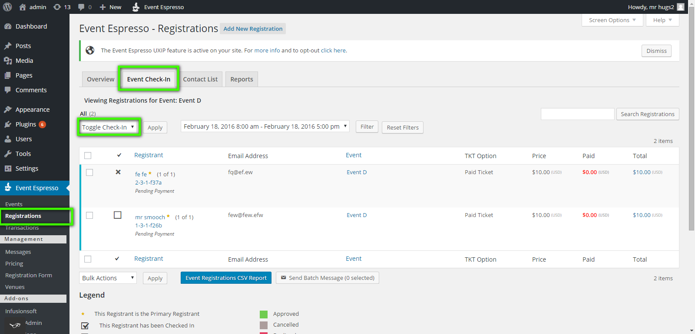

# /checkin

Added in EE 4.8.33, requires authentication and the `ee_edit_checkin` capability.

Checks registrations into, or out of, datetimes for an event.

This is functionally equivalent to the WordPress Dashboard's Event Espresso Registration Page's Event Check-In tab's "Toggle Check-In" action (see below).



Send this to checkin the registration into a datetime, and if they're already checked in, it will check them out. Note that it takes care of ensuring:

* the current user has logged in and has the "ee_edit_checkins" capability and can checkin the specified registration
* the registration is approved (setting "force"="true" disables this check)
* the registration's ticket limit isn't exceeded (eg if their ticket only allows them to checkin to 2 datetimes, it won't allow them to check into a 3rd datetime)

> Note: checking a user OUT of a datetime is only for record-keeping, it does not invalidate the checkin. Eg, if a ticket allows a user to checkin to 1 datetime, and the registration has been checked into a datetime, then they won't be allowed to check into any other datetimes on the event, even if they get checked out of the datetime they originally checked into. The only way to allow them to checkin to other datetimes would be to DELETE the original checkin record (not just check them out of the datetime they checked into).

### Route

POST `/ee/v4.8.33/registrations/{REG_ID}/toggle_checkin_for_datetime/{DTT_ID}`

where `{REG_ID}` is the registration's ID, and `{DTT_ID}` is the datetime's ID.

Eg if your site is `http://mysite.com`, and the WP API's prefix is `wp-json`, and you want to checking registration with ID 123 into datetime with ID 456, you would send a POST request to 

```
http://mysite.com/wp-json/ee/v4.8.33/registrations/123/toggle_checkin_for_datetime/456
```

### Parameters

`force`: can be provided as either a POST parameter, or as part of the raw JSON body (eg `{force:"true"}`). It can be "true" or "false". Defaults to "false". Setting it to "true" will check the registration into or out of the datetime regardless of whether they're approved or not.

### Returns

On success, returns the checkin resource created. Eg

```json
{
    "CHK_ID": 37,
    "CHK_in": true,
    "CHK_timestamp": "2016-02-03T22:25:08",
    "_links": {
        "self": [
            {
                "href": "http://src.wordpress-develop.dev/wp-json/ee/v4.8.33/checkins/37"
            }
        ],
        "collection": [
            {
                "href": "http://src.wordpress-develop.dev/wp-json/ee/v4.8.33/checkins"
            }
        ],
        "https://api.eventespresso.com/registration": [
            {
                "href": "http://src.wordpress-develop.dev/wp-json/ee/v4.8.33/checkins/37/registration",
                "single": true
            }
        ],
        "https://api.eventespresso.com/datetime": [
            {
                "href": "http://src.wordpress-develop.dev/wp-json/ee/v4.8.33/checkins/37/datetime",
                "single": true
            }
        ],
        "https://api.eventespresso.com/extra_metas": [
            {
                "href": "http://src.wordpress-develop.dev/wp-json/ee/v4.8.33/checkins/37/extra_metas",
                "single": false
            }
        ],
        "https://api.eventespresso.com/change_logs": [
            {
                "href": "http://src.wordpress-develop.dev/wp-json/ee/v4.8.33/checkins/37/change_logs",
                "single": false
            }
        ]
    }
}
```

On failure, returns an error response like the following:

```json
{
    "code": "rest_toggle_checkin_failed",
    "message": "Registration checkin failed. Please see additional error data.",
    "data": null,
    "additional_errors": [
        {
            "code": "ee_registration-toggle_checkin_status-1034",
            "message": "The given registration (ID:1) can not be checked in to the given DTT_ID (3), because the registration does not have access",
            "data": null
        }
    ]
}
```

Note that additional data about why the checkin failed is available in the `additional_errors` section. 

There are two `code` values possible:

* `rest_toggle_checkin_failed` when the registration isn't approved and we are not forcing check-in. Forcing check-in 
should resolve this.
* `rest_toggle_checkin_failed_not_forceable` for any other errors that may happen (like ticket uses would be 
exceeded, or the registration's ticket doesn't provide access to the datetime, or a database error occurred) , for 
which forcing check-in won't help

Note that the `additional_errors`'s `code`s might change slightly down the road because they're based on the line of 
the code where the error was encountered, and may change in future versions of the Event Espresso. For that reason, it's probably best to just show the additional errors' messages directly to the user.

## Example Usage

### Mobile App Example

You could use this to check users in and out of events from a mobile app. You would probably first need to use the EE4 ticketing addon so users can get tickets they bring to the event. Then they could present their tickets at the door of the event, where staff would use the mobile app on their phone to scan the ticket's barcode. The barcode contains the registration's code, which can be used to lookup the registration.

For example, if the registration's code is "123456789", you could find that registration using the EE4 REST API query `mysite.com/wp-json/ee/v4.8.33/registrations?where[REG_code]=123456789&limit=1`. Let's assume the registration's ID is 123. Then you should find what datetimes are available for the user using the query `mysite.com/wp-json/ee/v4.8.33/datetimes?where[Ticket.Registration.REG_ID]=123`, and ask the user which one they want to check the registration into in your mobile app. Once they have chosen, send a request to this checkin endpoint to check the registration in or out of that datetime.

If you want to provide an option to check in all the registrations related to the one who's presenting the ticket, you will first need to fetch the transaction from the registration on the barcode using the query `mysite.com/wp-json/ee/v4.8.33/registrations?where[REG_code]=123456789&limit=1&include=Transaction`, and remember the Transaction's "TXN_ID". Then find all the registrations on that transaction using the query `mysite.com/wp-json/ee/v4.8.33/registrations?where[Transaction.TXN_ID]={TXN_ID}` where `{TXN_ID}` is the Transaction's "TXN_ID". Then you would loop over all of the registrations found, and check them in using this checkin endpoint.

### Online Meeting Checkin/Out

Let's say you're using Event Espresso for online meetings using a service like Google Hangouts. With Google Hangout, you could create an app that could be activated by the user called something like "Event Espresso Checkin". The Google Hangout app could provide a user interface for setting the datetime ID. Then it could use Google Hangout's API to listen for when someone joins the hangout using [gapi.hangout.onParticipantsAdded](https://developers.google.com/+/hangouts/api/gapi.hangout.html#gapi.hangout.onParticipantsAdded). When someone joins, it could look them up the registration by email using the EE4 REST API using `mysite.com/wp-json/ee/v4.8.44/registration?where[Attendee.ATT_email]={email}`.  Then with that registration ID and datetime ID, it could check the registration in.