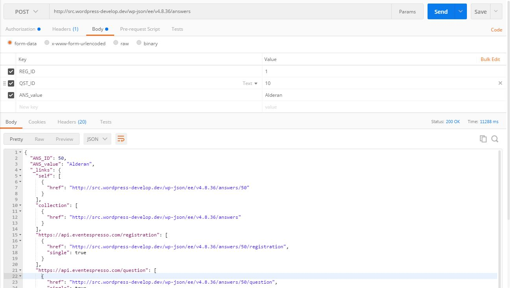
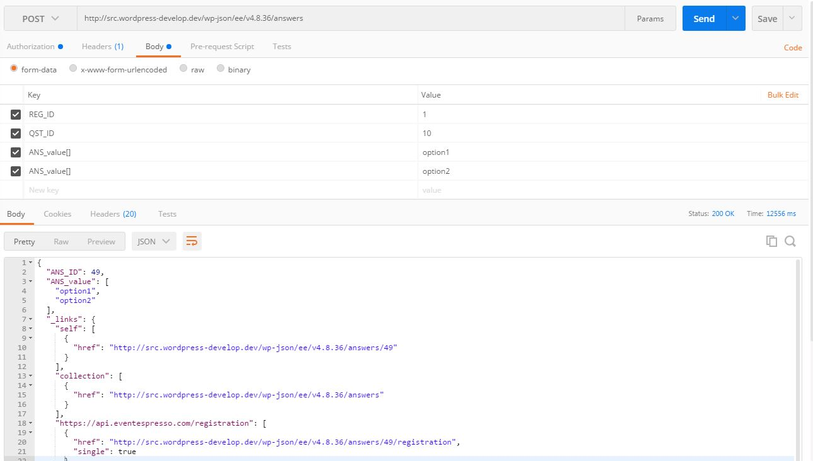
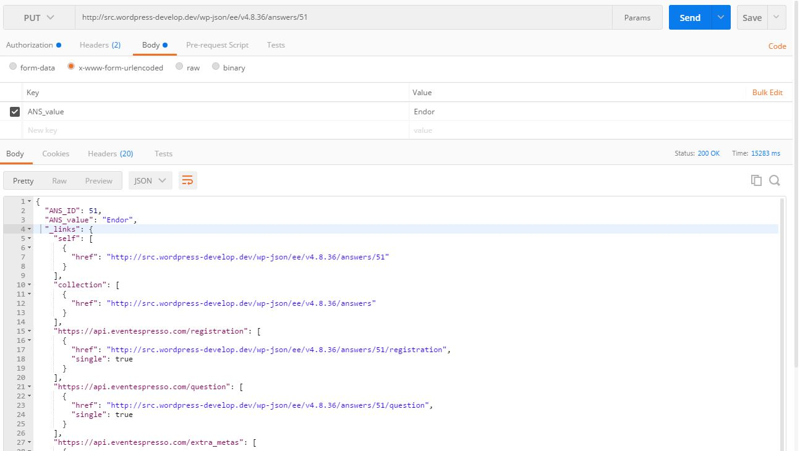
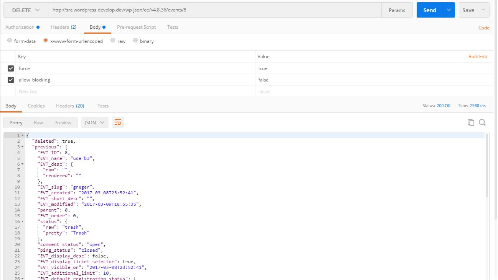

# EE4 REST API: Writing Data

This article gives an overview of how to write data to the EE4 REST API included in EE core. It would probably be a good idea first to read the documentation called, [EE4 REST API: An Introduction](ee4-rest-api-introduction.md).

## What Event Espresso Entities can I Write To?

As of EE 4.9.36, you can create, update, and delete data using Event Espresso's model system. That's events, 
registrations, attendees, venues, questions, etc. All data used by Event Espresso, except configuration 
data (that is stored in the WordPress options table; if you want to write to that, let us know in our Support Forums).
 
There are lots of Event Espresso resources you can write to. To see exactly what routes and HTTP methods are available, 
you can look through
 the [WP API index](https://developer.wordpress.org/rest-api/using-the-rest-api/discovery/) on your site, which also
 tells you what arguments you can provide. [Here's the WP API index page for one of our demo sites.](https://demoee.org/wp-json)
 


## How to Send Arguments

You can either send the arguments either in the url-encoded body of the requests or as a JSON body. In the screenshots in this documentation, [Postman](https://www.getpostman.com/) is being used.


## Discovering What Arguments I Need to Provide

When inspecting the WP API index page, you can see the "arguments" allowable. E.g., see the following excerpt:

```json
"/ee/v4.8.36/answers": {
      "namespace": "ee/v4.8.36",
      "methods": [
        "GET",
        "POST"
      ],
      "endpoints": [
          ...
        {
          "methods": [
            "POST"
          ],
          "args": {
            "REG_ID": {
              "required": false,
              "default": 0,
              "description": "Registration ID",
              "type": "integer"
            },
            "QST_ID": {
              "required": false,
              "default": 0,
              "description": "Question ID",
              "type": "integer"
            },
            "ANS_value": {
              "required": false,
              "default": "",
              "description": "Answer Value",
              "type": [
                "object",
                "string"
              ]
            }
          }
        }
      ],
      ...
    },
```
So this says when you're sending a POST request to `ee/v4.8.36/answers`, you can provide an integer `REG_ID` (which 
is the ID of the registration to whom belongs the answer), an integer `QST_ID` (which is the ID of the question the 
registration answered), and a string or JSON object for `ANS_value` (most answers to questions just take a single 
string, but some, like checkbox or multi-select inputs, take a JSON array).
   
# Creating/Posting
To create a new entry, send a `POST` request to the resource's collection route. Eg, to create a new answer entity, send it to `ee/v4.8.36/answers`.
You only need to provide the arguments which have `required: true` (see (Discovering What Arguments I Need to Provide)[##Discovering What Arguments I Need to Provide]).

For example, here is a screenshot from Postman, where a POST request created a new answer with value "Alderan":


Here is another screenshot from Postman, where a POST request created a new answer with two values: "option1" and 
"option2":


After a successfully posting a new item, it is immediately returned in the response. Note: you can include a query string on these requests too, to modify
what data is returned, just like a standard GET request. See [our section on reading data](ee4-rest-api-reading-data.md).

# Updating/Putting

To update an entity, send a `PUT` or `PATCH` request to the entity's route. E.g., if you want to update the answer with ID `123`, the request
 would go to `ee/v4.8.36/answers/123`.
 
 Also importantly: you do not have to provide all arguments when updating an entity. Any arguments not provided, will not be updated. 
 
For example, here we only update the answer's `ANS_value`, while leaving the `REG_ID` and `QST_ID` unchanged:


**Gotcha!** `PUT` and `DELETE` requests need to use the `x-www-form-urlencoded` option. See [the related GitHub issue](https://github.com/WP-API/WP-API/issues/2451).

# Deleting

There are two kinds of "delete"s: trashing/soft-deleting/archiving, and then hard/permanent deletes.

## Trashing/Soft-Deleting/Archiving

To trash/archive/soft-delete an entity, send a `DELETE` request to the entity's route.
 
For example, here is a request that trashed an event:
 
 

Notice that the response returns the updated entity. This is different from permanent deletions.
 
Yes, you could also use a `PUT` request to change the status too; this endpoint is available just for convenience.

On events, venues, and attendees, "trashing" an event changes their status to "trash". On resources with a `deleted` property (eg tickets, datetimes, and registrations), it will change it from `false`
 to `true`. 
 
 However, not all EE4 resources can be trashed. For these, you need to specify a permanent deletion, as explained below.
 
## Permanent/Hard Deleting
 
If you want to delete the entity permanently, you need to 
provide the `force` argument and set it to `true` ("permanent" may have been a better name for this argument, but we used this for the sake of consistency with the WP API's core routes).



Notice that the response contains `success`, indicating whether the entity was successfully removed from the database or not. It also includes `previous`, which is the entity
before it was deleted (which no longer exists).

## Blocking Deletes

Before an entity is deleted, Event Espresso automatically checks there is no other data that relies on it (ie, has a foreign key to it). If it does, the request will fail.
In order to circumvent this, you will need to first delete that dependent data. E.g., before you can delete a registration, you will first need to delete its answers.
Alternatively, you can provide the argument `allow_blocking` and set it to `false`.

# Gotchas:

## How Do My User's Capabilities Affect My Ability to Write Data?

In this initial implementation, we have overly simplified use of capabilities: basically, site administrators can 
write to ALL EE4 resources, whereas every other user can't. We are working on enabling more fine-grained capabilities
 (like allowing an event manager to write to their own events, but not others' events) but that is not yet completed. 

## Relations: discovering them, what relations establish 

EE4 data is also highly inter-related. E.g., each event has 
many datetimes, which can have many tickets, which can have many registrations for those tickets, which each have an 
attendee, etc. This [venn diagram of EE4 models](https://github.com/eventespresso/event-espresso-core/blob/master/docs/images/models-venn-diagram.png)
can help give you an overview of how our data is inter-related. But to get the details, you can send an `OPTIONS`
HTTP request to a route you want to know more about, and inspect it's schema. [Learn more about using our REST API 
schemas here](ee4-rest-api-schema.md#relations). The properties which are marked as `foreign_key` indicate entities of this type depend on that related entity.
E.g., registrations have an `ATT_ID`, which is a foreign key to `Attendee`s, meaning registrations should point to related attendee records. So before you create
a registration, either create a new attendee, or find the ID of an attendee ID you want to attribute this registration to.


## Dates and Times; provide GMT or non-GMT?

When inserting or updating entities with datetime properties, you can either provide the GMT or non-GMT fields (if you provide both, the GMT field will be ignored, like
it currently is with WP core API, although this behavior may change if WP API changes). E.g., when creating a ticket, you can set its start date using either
* `TKT_start_date`: the value you provide is assumed to be in the site's default timezone, or
* `TKT_start_date_gmt`: the value you provide is assumed to be in GMT (a.k.a. UTC). 

It is recommended you use the GMT properties because it is likely the timezone you currently live in is not necessarily the same as the WordPress site's default timezone,
and so you may see unexpected results using the non-GMT property.

## Serialized data

Entity properties of type `object` can have JSON objects (eg `{"foo":"bar"}`) or JSON arrays (eg `["foo","bar"]`) submitted to them. But you CANNOT submit a string
of serialized PHP (eg `a:1:{s:3:"foo";s:3:"bar";}`). Even if the string you are submitting doesn't contain any PHP objects, the EE4 REST API will not accept any string of serialized data.