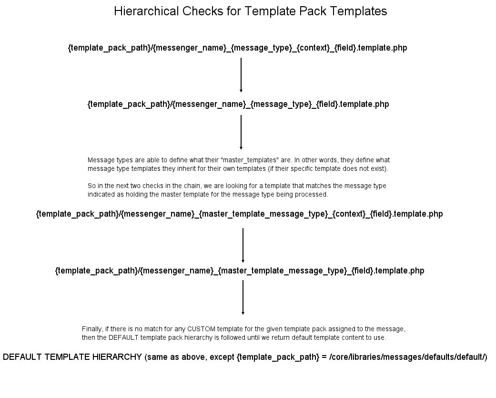

# Introducing Message Template Packs and Variations - an Overview

The purpose of this documentation is to give an overview of the message template pack and variation api in the EE messages system and outline how developers can add additional template packs and variations.

## Background

First, let's do a little background on how the messages system templates work.  On activation, Event Espresso uses hard coded template files for each messenger, message type, context and field content to setup the **default** templates.  These defaults then get saved to the database and all future edits, custom templates etc are saved in the database.  When a user resets a template to defaults, the same hard coded templates are used to regenerate the templates again and save in the database.

Prior to adding the template pack and variation feature to messages,  there were only two ways to provide a new custom template layout to customers to use:

1. Modify the layout directly in the template editor and then use a filter for swapping out any styles used.
2. Edit the default templates in core, and then reset to defaults using the ui to bring in these changes.

We realized that long term, both of these solutions are not workable and we needed a better way for quickly adding new layouts and styles to templates.  At the same time, we needed something that was flexible enough to account for all kinds of different messengers and message types that may be registered with the system over time.  Thus, template packs and variations were born.

## What is a Template Pack vs. Variation?

Put in the simplest terms, a *template pack* is a set of files that describe the *layout*, *structure*, and default content of a message template.  Template variations MOST often will describe the *style* of the final output.  However, it's labelled "variation" specifically because there may be some messenger/message type template combinations where a variation describes something else (for example, an api messenger have different versions in use, and the variation allows you to indicate what version to use for communicating with it).

Template Packs have a configuration that registers what messenger and message types they support.  Therefore they are *registered* with messenger and message type combinations.  This means that you could have a template pack that supports the `email` messenger and `registration approved` message type but does not support the `email `messenger and `payment received` message type.  A template pack can be registered to multiple messenger and message type template combinations.

Variations are registered with specific template packs.  While there can be multiple variations with a template pack, variations are not automatically shared among DIFFERENT template packs.  Also, when registering variations, it is possible to indicate certain variations will only appear with certain messenger and message type combinations.

In other documents, we'll get into the actual process of creating new template packs and variations, however for now, remember that template packs and variations have a configuration setup in a child class of `EE_Messages_Template_Pack` and then contain templates in a certain naming schema for all the various content.   Variations are in their own files as well.

The other important thing to remember with Template Packs and Variations is that when they are registered correctly,  Event Espresso takes care of setting up all the ui and processing for template packs and variations.

## Code Flow Diagram

Go [here](code-flow-diagram.md) to see a diagram of how the code flows in the messages system.

## Hierarchical Loading

The new template pack system has a hierarchical loading structure.  While the core of a new template pack is the template pack class that defines certain properties.  All template packs and variations require files that are in a certain naming schema.  If a template that is being requested doesn't exist, then the system will fallback to the next template in the hierarchy.  The ultimate fallback for all template packs is the templates and variations belonging to the `EE_Messages_Template_Pack_Default` template pack which is bundled with Event Espresso core.

Here's a diagram illustrating this:

