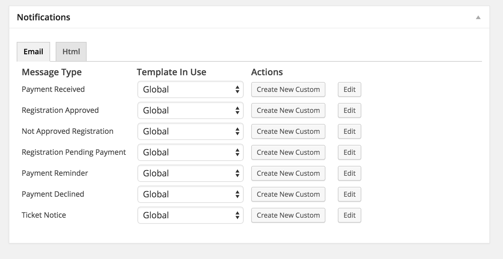

# Registering a Message Type for the Messages System

```php
/**
	 * Takes care of registering the  message types that are only available in caffeinated EE.
	 *
	 * @since   4.3.2
	 *
	 * @return  void
	 */
	public function register_caf_message_types() {
		//register newsletter message type
		$setup_args = array(
			'mtfilename' => 'EE_Newsletter_message_type.class.php',
			'autoloadpaths' => array(
				EE_CAF_LIBRARIES . 'messages/message_type/newsletter/'
				),
			'messengers_to_activate_with' => array( 'email' ),
			'messengers_to_validate_with' => array( 'email' )
			);
		EE_Register_Message_Type::register( 'newsletter', $setup_args );

/** other message types registered here **/
}
```


Event Espresso 4 core has a collection of powerful subsystems that enhance the flexibility and extensibility of the event management system.  One of these subsystems is the Messages system which is used to send notifications.  You can go here for a [good overview of the system](https://eventespresso.com/2014/03/messages-systemyour-tool-getting-word/).

Beginning with the release of 4.6.0, it has become super easy to add a new message type to the messages system.

> **Note:** "Easy" of course is a relative term.  I'm using that under the assumption that the person reading this is a developer familiar with php and OOP oriented programming.

## What is a message type?

Message Types are the *kind* of message that is being sent.  Usually message types have a close correlation with the trigger point for the message.  For example, the `registration_approved` message type is triggered whenever a registration is.... *approved* and thus the content of it matches that context.

## Registering a message type

While reading this documentation, it will be helpful if you open up the `caffeinated/EE_Caf_Messages.class.php` file in Event Espresso Core, where you will find that we register the newsletter, payment_declined, payment_reminder, declined_registration, and cancelled registration message types using this method.

Here's a rundown of all the things you need to have in place to register a new message type:

1. A callback hooked on the `EE_Brewing_Regular___messages_caf` action hook.
2. In the callback you will call the handy plugin api EE provides for registering message types called `EE_Register_Message_Type::register()`.
3. Create a class that extends `EE_message_type` that contains the details on your message type.
4. Create a class that extends `EE_Messages_Validator` for your message type.
5. Default templates for your new message type.
6. Set trigger points for your message type.

Let's step through each of the above items using the newsletter message type as an example.

### A callback hooked on the `EE_Brewing_Regular___messages_caf` action hook.

You register a callback using the WordPress action system:

```php
add_action('EE_Brewing_Regular___messages_caf', array( $this, 'register_caf_message_types' ) );
```

Then you'll see in the `EE_Caf_Messages` class the callback defined.

```php
/**
 * Takes care of registering the  message types that are only available in caffeinated EE.
 *
 * @since   4.3.2
 *
 * @return  void
 */
public function register_caf_message_types() {
	//register newsletter message type
	$setup_args = array(
		'mtfilename' => 'EE_Newsletter_message_type.class.php',
		'autoloadpaths' => array(
			EE_CAF_LIBRARIES . 'messages/message_type/newsletter/'
			),
		'messengers_to_activate_with' => array( 'email' ),
		'messengers_to_validate_with' => array( 'email' )
		);
	EE_Register_Message_Type::register( 'newsletter', $setup_args );

	/** other message types defined here */
}
```

### In the callback you will call the handy plugin api EE provides for registering message types called `EE_Register_Message_Type::register()`

In the callback code example above, you'll see that we defined some setup arguments and assigned to `$setup_args` and then we included that as an argument for the `EE_Register_Message_Type::register()` method.  Basically this is utilizing a handy tool that makes it easier to register new message types with the EE messages system without having to know all the hooks and filters needed to add things in.  Let's step through the `$setup_arguments` array:

#### mtfilename (string)

The value for this array key should point to the name of the message type class that defines your new message type.  We'll get to the contents of that class later.

#### autoloadpaths (string)

The value for this array key should point to the path for all the files used by your new message type.  This ensures that the messages system knows where to look for those files when required.

#### messengers_to_activate_with (string)

The value for this array key is an array of messengers (the representative slugs) that your new message type should activate with.  In other words, if you want your message type to be activated with the email messenger whenever it is activated, then you indicate so using this array. I should mention, that the only valid messengers for this array are those that your message type is valid with (see next parameter).

#### messengers_to_validate_with (string)

The value for this array key is an array of messengers (the representative slugs) that your new message type is valid with.  Simply put, this means that your message type can be used with the messengers listed in this array.

#### forced_activation (boolean)

Although this is not shown in the code example for newsletter message type (because it is optional), the value for this array key indicates that this message type MUST be activated when the plugin your code is in is activated/reactivated (default false).  Note that this ONLY applies when you are registering a new message type through the `EE_Register_Addon` api (more on that later).

Once you have your `$setup_args` array defined you simply include it as the second argument for the `EE_Register_Message_Type::register()` method. The first argument can be any arbitrary string to represent your message type (which can then be used to deregister if needed).  Note that the string you use for the first argument should be unique - so its good to prefix it as something specific to your plugin (eg. use the initials of your plugin and the message type slug).

### Create a class that extends `EE_message_type` that contains the details on your message type.

For the purpose of this section, it'd be good to reference the `EE_Newsletter_message_type.class.php` found in `/caffeinated/core/libraries/messages/message_type/newsletter/EE_Newsletter_message_type.class.php`.

There are a few requirements for the message type class you create:

#### Naming schema

The name of your message type class must follow the naming schema: `EE_{message_type_name_sentence_case}_message_type.class.php`.

So, let's say the canonical name we are going to use for our new message type is "automated_reminder".  Then the name of the message type class should be: `EE_Automated_Reminder_message_type.class.php`

#### Extends EE_message_type or a child class of EE_message_type:

All message type classes MUST extend EE_message_type or a child class of EE_message_type.  For example, our newsletter message type is extending EE_message_type, however if you look at `EE_Cancelled_Registration_message_type` you'll see it extends the `EE_Registration_Base_message_type` which is a parent class shared by all registration status type message types.  However `EE_Registration_Base_message_type` extends the EE_message_type class.

#### Define important properties in the constructor:

The properties your message type must define are:

**$this->name**: This is the canonical reference to your message type.  In the case of the newsletter message type this is "newsletter".  This property string is also reflected in your class name.

**$this->description**: This is a short description of what your message type does.  It will be utilized whenever your message type is referenced in the EE admin ui.

**$this->label**: This should be an array with 'singular' and 'plural' keys representing the internationalized labels for your message type.

**$this->master_templates**:  This is an array where the keys are the messenger, and the values are the message type that serve as the master templates for your message type.  Master templates are what are used as fallbacks when default message templates are being generated and there is no defined template for a requested field. This basically makes it possible to inherit default templates prepared for other message type/messengers combinations.

**So in the case of the newsletter message type**.  It defines the master template for the email messenger as the registration message type.  This means that when the newsletter message type is first activated for the email messenger, OR a user resets the newsletter message type template for the email messenger, if there is no defined template specific to a field, then the messages system will use what is defined for the registration message type and email messenger for that field.  If the registration message type and email messenger did not have a template defined for that field then just an empty string will be used.

#### Set any registered admin pages this message type will be used with.

This is done via the `_set_admin_pages()` method which in turn sets the `$admin_registered_pages` property.

If you look in the Newsletter message type class, you'll see that it simply sets `$admin_registered_pages` to be an empty array because it is not being registered for a specific EE admin page (instead its utilizes custom hooks to integrate with various pages).  So let's take a look at a message type that does use this and for that we'll open up the `EE_Registration_Base_message_type` (which if you'll remember from above is the parent class for all the registration status type message types.

In here, we find that the `_set_admin_pages()` method fills the value of the `$admin_registered_pages` property with the following:

```php
$this->admin_registered_pages = array(
	'events_edit' => TRUE
	);
```

Currently the messengers take care of the content and integration with the defined admin page route, so all this is doing is telling the messages system that when the Messages metabox is setup on the events_edit route(s), that this message type is to be included in the generated content.  In the case of this particular route, the content is the per event message type selector.



So, if you'd like your message type to integrate with the message type meta-box in the event editor, then all you need to do in your message type class is add the following:

```php
protected function _set_admin_pages() {
	$this->admin_registered_pages = array(
		'events_edit' => TRUE
		);
}
```

#### Set the Data Handler

In the newsletter message type class you'll see this method:

```php
protected function _set_data_handler() {
	$this->_data_handler = 'Contacts';
	$this->_single_message = $this->_data instanceof EE_Registration ? true : false;
}
```

A Data Handler is a class that prepares incoming data sent via a messages trigger (usually hooked into a action somewhere in the EE system) so that it's setup correctly for the messages system to use when generating messages.  Currently in EE there are four different data handlers:

- `EE_Messages_Gateways_incoming_data`: This data handler expects the incoming data to be an array with an EE_Transaction object as the first value and (optionally) an EE_Payment object as the second value.  To reference this data handler, message types use the string `Gateways` as the value for the `_data_handler` property.

- `EE_Messages_REG_incoming_data`: This data handler expects the incoming data to be an EE_Registration object.  To reference this data handler, message types use the string `REG` as the value for the `_data_handler` property.

- `EE_Messages_Contacts_incoming_data`: This data handler expects the incoming data to be an array of EE_Attendee objects.  To reference this data handler, message types use the string `Contacts` as the value for the `_data_handler` property.

- `EE_Messages_Registrations_incoming_data`: This data handler is similar to the `EE_Messages_REG_incoming_data` in that it processes `EE_Regsitration` however, this one prepares data for message types that send messages for multiple registrations (that could span multiple transactions) and handles incoming data that is an array of EE_Registration objects (vs a single object).

What data handler should you use?  It all depends on what data is present where you want to trigger a message for your message type.  If there is an EE_Transaction available at that trigger point, then your message type should define the data-handler as 'Gateways'.  If there is an EE_Registration, then use 'REG'.  If there is an EE_Attendee object, then use 'Contacts'.  Or, you can also create your own data handler and as long as its setup correctly (following a naming schema) and in the same path as the autoloaders path defined when you registered your message type, then it will work.  Custom data handlers are outside the scope of this document but it IS possible.

#### Define a `_get_data_for_context()` method

This is a special method that helps translate triggers for message types that happen via url.  To ensure urls that are hard to guess and obfuscated, they are generated via the reg_url link of a registration and thus the data from url triggers is a EE_Registration object.  The `[DISPLAY_HTML_URL]` messages shortcode parses to the url trigger for a message that is sent and the generated url when clicked by the recipient, will result in an html view of the message.  To correctly generated the correct html for this view, the messages system needs to know how to setup the message for the registration indicated in the url.  That's where this method comes in. Here's what the newsletter message type does:

```php
protected function _get_data_for_context( $context, EE_Registration $registration, $id ) {
	//newsletter message type data handler is 'Contacts' and it expects an array of EE_Attendee objects.
	$contact = $registration->attendee();
	if ( $contact instanceof EE_Attendee ) {
		return array( $contact );
	}
	return array();
}
```

Remember that the newsletter message type has defined its data handler as `Registrations` which means it uses the `EE_Messages_Registrations_incoming_data`.  That means, it expects an array of EE_Registrations for its data handler.  So, when the messages system triggers a newsletter message type via a url trigger, it sends a EE_Registration object, and uses this method defined in the newsletter message type to convert that EE_Registration object into the data type the newsletter message type EXPECTS for its messages which in this case is an array.

Note, its important that if you are unable to set up the correct data type from the registration object, that you return an empty array().  This indicates to the message system that something went wrong and it will generate an appropriate error message automatically.

#### _set_admin_settings_fields()

This method is used by message type classes to define the `$_admin_settings_fields` property.  This is a special property that allows message types to have specific settings attached to them.  This document will not go into details about this property but you do need to define the method and set the property.  If your message type will not have any additional admin settings then you can simply set an empty array as the value for the property (this is what the newsletter message type does).

#### _set_contexts()

Contexts in the messages system are typically used to define the "recipients" of the messages, or specific 'contexts' for the messages being generated.  This method is used to define the contexts for your message type and the context labels.  Here's what the newsletter message type does:

```php
protected function _set_contexts() {
	$this->_context_label = array(
		'label' => __('recipient', 'event_espresso'),
		'plural' => __('recipients', 'event_espresso'),
		'description' => __('Recipient\'s are who will receive the message.', 'event_espresso')
	);

	$this->_contexts = array(
		'attendee' => array(
			'label' => __('Registrant', 'event_espresso'),
			'description' => __('This template goes to selected registrants.', 'event_espresso')
		)
	);
}
```

So in this case, the newsletter message type is setting the context label so that contexts are referred to as variations of "recipient" in the messages ui for it.  It is also defining only one context,  'attendee', which is labeled as "Registrant" in the messages ui for the newsletter messages system.  The slug 'attendee' is important because it is used elsewhere in the message type class for defining how that context is handled.

There are three core contexts that are defined in the EE_message_type parent that you can inherit for how they get setup, 'attendee', 'admin', and 'primary_attendee'.  If you use one of these contexts then you do not need to add your own method for setting up addressee data for that context.  However, if you need to do something different with one of the core contexts, or you define a new context, then your message type must have a method following this schema: `_{context}_adressees()`.  The primary purpose of these dynamic methods is to return an array of `EE_Messages_Adressee` objects that the messages generator can use for setting up messages.  You can learn more by opening up `EE_message_type` and seeing how it sets up the addressee objects via `_attendee_addressees`, `_primary_attendee_addressees`, and `admin_addressees`.

#### _set_valid_shortcodes()

Finally, every message type class must define this method which is responsible for defining the `$_valid_shortcodes` property.  This property contains an array of valid messages shortcodes per context for your message type.

Here is what the newsletter message type does:

```php
protected function _set_valid_shortcodes() {
	parent::_set_valid_shortcodes();

	$included_shortcodes = array(
		'recipient_details', 'organization', 'newsletter'
	);

	foreach ( $this->_valid_shortcodes as $context => $shortcodes ) {
		foreach ( $shortcodes as $key => $shortcode ) {
			if ( !in_array( $shortcode, $included_shortcodes ) )
				unset( $this->_valid_shortcodes[$context][$key] );
			}
		$this->_valid_shortcodes[$context][] = 'newsletter';
	}

}
```

Shortcodes in the messages system are organized into various groups which represent the shortcode parser classes that handle parsing the shortcodes used in templates.  What the newsletter message type is doing here is grabbing what valid shortcodes are set by default via the parent class, then overriding those shortcodes so that we end up with an array of valid shortcodes specific to the newsletter message types contexts.

This property is used by the messages system when message templates are being edited to ensure that valid shortcodes are displayed for each field in the editor as well as validating those shortcodes when the template is saved.

Note, this property is only defining what shortcode libraries this specific message type accepts.

Once you've got your message type class done, make sure it is added to the path you defined for the autoloader path in registering your message type. On to the next step!


### Create a class that extends `EE_Messages_Validator` for your message type.

Remember how in your message type class you defined a `$_valid_shortcodes` property?  This is useful for restricting what shortcodes can be used with that message type.  However, there still may be cases where you want to further restrict what shortcodes can be used with a specific field or context for your message type, or even exclude one specific shortcode (instead of a shortcode library).  The way you do this is via the EE_Messages_Validator class.  Defining a Validator class is not optional.

#### Naming Schema

Like the message type class, the validator class(es) for your message type must follow a specific naming schema:

**EE_Messages_{Messenger}_{Message_Type}_Validator**

As the schema suggests, there should be a validator class for each messenger your message type supports.  In the case of the newsletter message type, the name of the class is `EE_Messages_Email_Newsletter_Validator`.  Your message type validator class should be placed in the autoloader path you defined when registering the message type.

Your validator class must extend `EE_Messages_Validator`.

#### Define properties

In the constructor for your validator class you will need to define the following properties.  This may change at some point in the future (because the info defined in these properties is technically available via the naming schema), but for now you must define in the constructor of your class:

* **$this->_m_name** = the messenger slug for this validator (in the case of our example it's 'email')
* **$this->_mt_name** = the message type slug for this validator (in the case of our example it is 'newsletter').

#### _modify_validator

The final thing you must do in your validator class is define the `_modify_validator` method.  This is used to setup all the various specific shortcode validation rules/setup for this particular message type and messenger combination.

There are a couple properties you will interact with most often in this method and we'll go over them here.

**`$this->_valid_shortcodes_modifier`**

This property is a multi-dimensional array indexed first by message type context, then next by messenger field where the values are an array of valid shortcode libraries for that context and field.  Please note, that you are able to refine EXISTING valid shortcodes, but not add shortcode libraries that aren't valid either as defined by the messenger or the message type.

So for example.  If the email messenger defines 'organization', 'event_list', 'attendee_list' as a valid shortcode libraries for the 'content' field, and the "special" message type defines 'organization', 'event_list' as valid shortcode libraries for the admin context:

This would be acceptable:

```php
$this->_valid_shortcodes_modifier['admin']['content'] = array('organization');
```

Whereas this would not:

```php
$this->_valid_shortcodes_modifier['admin']['content'] = array('question_list');
```

The latter example will not work as expected because 'question_list' is NOT a shortcode library that is valid for both the messenger and message type.

**`$this->_specific_shortcode_excludes`**

This property allows you to set an array of specific shortcodes to disallow.  The array is indexed by messenger field, and the values should be an array of specific shortcodes.  This is very useful when you want a shortcode library to be valid but NOT every shortcode in that library to be valid for a field.

### Default templates for your new message type.

The last step for registering a new message type is to setup template files that will be used to generate the default templates on activation or when a user resets a message template for your message type.  There is already some excellent documentation about how the message template system works, so we're just going to direct you there:

* [Introducing Message Template Packs and Variations](overview-message-template-packs-variations.md) - this has a good template hierarchy diagram that shows how template files are structured.
* [Registering a Message Template Pack](registering-message-template-packs.md) - Step Two in this doc has a good overview of how the template system works.

### Set trigger points for your message type

Now that you have your message type all set up, you need to define some trigger points that will be used to kick off the generation and delivery of a message using your message type.  The best way to learn how to do this is to open up `EED_Messages` as it contains all the triggers for the core message types.

The important thing to remember is that messages are simply triggered on actions/filters in EE.  So the first step is to determine what you want triggering your message/notification.  The next step is to find a good action that you can hook into (if there isn't one, feel free to submit a pull request against EE core and we'll look at adding it for you).  The next step is to build the hook and callback on that action, and then utilize the EE_Messages controller for sending things off.

The easiest way for doing all this is to create a new module that extends EED_Messages.  That way you can inherit the existing methods EED_Messages exposes for your trigger callback.  A good example of this in use is to look at the EE Ticketing addon.  `EED_Ticketing` extends `EED_messsages` and utilizes EED_messages methods in its trigger callbacks.

## Wrap Up

Once you understand how to register new message types with the EE messages system, the sky's the limit in the different things you can do for notifications!

In this document we've outlined how you can directly call the `EE_Register_Message_Type` plugin api for setting up the new message type.  However, the preferred way for doing this is via the `EE_Register_Addon` api that is available ([You can read about it here](../D--Addon-API/registering-addons.md)).  When using that method, you simply include an array of configurations for each message type you are registering in the same format as what `EE_Register_Message_Type` expects.  Using EE_Register_Addon is the preferred method of implementing the message type api because it automatically takes care of a number of other things related to EE addons that are easy to miss.