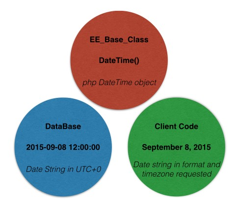

# Dates, Times and Timezones in EE Models

Event Espresso is a plugin that helps you manage events, so it only makes sense that it nails the use of dates, times and timezones.  This document will highlight how we've implemented dates and times in the EE Model system.

> **Please Note:** This document has been updated to reflect changes made to the EE Datetime System introduced in version 4.8.0 - this document does not apply to EE core versions prior to 4.8.0.

## EE_Datetime_Field

This is a special model field that is used to describe database columns setup in `EEM_` models.  An example of where this happens can be found in the [EEM_Datetime](https://github.com/eventespresso/event-espresso-core/blob/master/core/db_models/EEM_Datetime.model.php) model:

```php
$this->_fields = array(
	'Datetime'=>array(
		'DTT_ID'=> new EE_Primary_Key_Int_Field('DTT_ID', __('Datetime ID','event_espresso')),
		'EVT_ID'=>new EE_Foreign_Key_Int_Field('EVT_ID', __('Event ID','event_espresso'), false, 0, 'Event'),
		'DTT_name' => new EE_Plain_Text_Field('DTT_name', __('Datetime Name', 'event_espresso'), false, ''),
		'DTT_description' => new EE_Full_HTML_Field('DTT_description', __('Description for Datetime', 'event_espresso'), false, ''),
		'DTT_EVT_start'=>new EE_Datetime_Field('DTT_EVT_start', __('Start time/date of Event','event_espresso'), false, time(), $timezone ),
		'DTT_EVT_end'=>new EE_Datetime_Field('DTT_EVT_end', __('End time/date of Event','event_espresso'), false, time(), $timezone ),
		'DTT_reg_limit'=>new EE_Infinite_Integer_Field('DTT_reg_limit', __('Registration Limit for this time','event_espresso'), true, INF),
		'DTT_sold'=>new EE_Integer_Field('DTT_sold', __('How many sales for this Datetime that have occurred', 'event_espresso'), true, 0 ),
		'DTT_is_primary'=>new EE_Boolean_Field('DTT_is_primary', __("Flag indicating datetime is primary one for event", "event_espresso"), false,false),
		'DTT_order' => new EE_Integer_Field('DTT_order', __('The order in which the Datetime is displayed', 'event_espresso'), false, 0),
		'DTT_parent' => new EE_Integer_Field('DTT_parent', __('Indicates what DTT_ID is the parent of this DTT_ID'), true, 0 ),
		'DTT_deleted' => new EE_Trashed_Flag_Field('DTT_deleted', __('Flag indicating datetime is archived', 'event_espresso'), false, false ),
	));
```

Notice that in this field definition array, `DTT_EVT_start` and `DTT_EVT_end` database columns instantiate the `EE_Datetime_Field object` that describes the field.  Basically this class helps define what happens whenever DTT_EVT_start or DTT_EVT_end values are retrieved from the database, saved to the database, set on the Model Object ([EE_Datetime](https://github.com/eventespresso/event-espresso-core/blob/master/core/db_classes/EE_Datetime.class.php)) or retrieved from the model object.

The important things to remember about how Dates and Time values "live" in the various "zones" are these:

1. Within the model system, they are always a php [DateTime](http://php.net/manual/en/class.datetime.php) object.  This will be in the timezone set on the model when instantiated.
2. They are always found in the database as a mysql timestamp (Y-m-d H:i:s) for the UTC+0 timezone.
3. By default, clients will receive dates and times in whatever format and timezone is set in their WordPress Options.
 


## Getters and Setters

For easier retrieval (gets) and setting (sets) of values on model objects that happen to correlate with `EE_Datetime_Field` db columns, there are some methods found in [EE_Base_Class](https://github.com/eventespresso/event-espresso-core/blob/master/core/db_classes/EE_Base_Class.class.php) to facilitate this.

### `get_date( $field_name, $format = NULL )`

This method retrieves the date for the given field in either the format that has been set internally in the class or the specified format via the `$format` argument. Here's an example:

```php
//first let's get a known event from db
$event = EEM_Event::instance()->get_one_by_ID(98);

//get the first related EE_Datetime object on that event
$dtt = $event->get_first_related('Datetime');

//use the get_date() method to retrieve the date for the DTT_EVT_start field in the default format.
$date_start = $dtt->get_date('DTT_EVT_start');

//echo it.
echo $date_start;
```

This will result in:

`April 25, 2014`

What if I want that date in a different format?  Say something like **Thursday, March 27th, 2014**?  You can give this method any format string acceptable for the php [date()](http://php.net/manual/en/function.date.php) function.  So for what we want, we'd do:

```php
$date_start = $dtt->get_date('DTT_EVT_start', 'l, F jS, Y');
echo $date_start;

//prints Friday, April 25th, 2014
```

**Caching:**  It's important to remember, that internally, `EE_Base_Class` caches the converted date string for the given field and the given format.  That means that any future calls after setting a format will return in the previously set format.  For example, if  I was to do:

```php
$event = EEM_Event::instance()->get_one_by_ID(98);
$dtt = $event->get_first_related('Datetime');

echo $dtt->get_date('DTT_EVT_start', 'l, F jS, Y');
echo '<br />'

/*... lots of code in between here and there ..*/

//echo the date again somewhere else
echo $dtt->get_date('DTT_EVT_start');

//prints
//Friday, April 25th, 2014
//Friday, April 25th, 2014
```

This is  very useful when you are repeating that date string throughout the loaded page, however, you have to remember this if there is ever a place where you want to use a different format or use the default.  Let's say in the above example, I wanted to print out the second date in the default format?  This is how I would do it:

```php
$event = EEM_Event::instance()->get_one_by_ID(98);
$dtt = $event->get_first_related('Datetime');

echo $dtt->get_date('DTT_EVT_start', 'l, F jS, Y');
echo '<br />'

/*... lots of code in between here and there ..*/

//echo the date again somewhere else
echo $dtt->get_date('DTT_EVT_start', '');

//prints
//Friday, April 25th, 2014
//April 25, 2014
```

Notice how we just sent an empty string.  That signals the `get_date()` method to ignore the cached property value and regenerate it using the default format.  We could also just send a new format and the new format would be used.


### `get_time( $field_name, $format = NULL )`

the `get_time()` method functions similarly to the get_date() method except that of course it applies to the "time" part of the date and time string.

### `get_datetime( $field_name, $dt_frmt = NULL, $tm_frmt = NULL )`

This method functions similarly to `get_date()` and `get_time()` except that it of course allows you to retrieve the date and time  in one string according to the formats you've indicated (optional).

### `e_date()`, `e_time()`, `e_datetime()`

These methods are identical to the equivalent "get_" methods except that instead of returning the value, they echo it.

### `get_DateTime_object( $field_name )`

This allows you to retrieve the internal php DateTime object for the named field.  So if you had a EE_Datetime object, and you wanted to get the DateTime object for the `DTT_EVT_start` field, you'd do something like this:  `$datetime->get_DateTime_object( 'DTT_EVT_start' );`.  Then you can manipulate that DateTime object however you want.

### `get_raw( $field_name )`

When `get_raw` is called on a field that is of the type `EE_Datetime_Field`, then it will return the unixtimestamp representing the value on that field.

## $timezone argument

One of the more powerful  things with the EE Date and Time code, is the ability to easily convert between timezones.  While at the time of this writing (version 4.8) we aren't using the functionality fully in EE core, it does enable future planned functionality for things such as:

1. Per Event timezone settings
2. User selectable timezone settings (which will automatically flip all displayed times in their timezone).

Any models that have a `EE_Datetime` field can have a `$timezone` argument sent when instantiating (or retrieving the already instantiated object - remember EEM models are singletons ), and this will set the internal timezone string to that value (provided its a [valid timezone](https://php.net/manual/en/timezones.php) string).  If the timezone string is NOT included, then the model assumes whatever is set as the timezone for the WordPress site is being used.  So let's take a look at some examples:

### Getting date time strings for a different timezone

Let's say we want to retrieve all the datetimes for an event so that when the dates are retrieved they are displayed for the given timezone.  There are multiple ways we could do this:

#### Set the timezone on EEM_Datetime

```php
//original time was April 25, 2014 8:00am in America/Toronto
//get a single datetime for an Event with an id of 98
$dtt = EEM_Datetime::instance('Europe/London')->get_one(array(array('Event.EVT_ID' => 98) ) );

//let's verify the EE_Datetime object is in the set timezone
echo $dtt->get_timezone();
echo '<br />';

//echo the datetime in default format.
echo $dtt->get_datetime('DTT_EVT_start');

//prints
//Europe/London
//April 25, 2014 1:00pm
```

#### Set the timezone on already retrieved EE_Datetime object.

```php
$dtt = EEM_Datetime::instance()->get_one(array(array('Event.EVT_ID' => 98) ) );
echo $dtt->get_timezone();
echo '<br />';
echo $dtt->get_datetime('DTT_EVT_start');
echo '<br />';
$dtt->set_timezone('Europe/London');
echo $dtt->get_timezone();
echo '<br />';
echo $dtt->get_datetime('DTT_EVT_start');

/**
 * Prints
 * America/Toronto
 * April 25, 2014 8:00am
 * Europe/London
 * April 25, 2014 1:00pm
 **/
```

#### Set the timezone on DTT object retrieved via EE_Event

```php
$event = EEM_Event::instance()->get_one_by_ID(98);
$event->set_timezone('Europe/London');
$dtt = $event->get_first_related('Datetime');
echo $dtt->get_timezone();
echo '<br />';
echo $dtt->get_datetime('DTT_EVT_start');

//prints
//Europe/London
//April 25, 2014 1:00pm
```

Notice in the above example how we set the timezone on the EE_Event object, and then when the related Datetime was retrieved, it automatically had the timezone set internally to the same timezone as the event.  Nifty eh?

As you can see there are multiple ways in which the timezone property can be used to set and retrieve timezones within `EE_Base_Class` objects that have `EE_Datetime_Field` fields.  However there is a "gotcha" that you need to be aware of.

#### The EEM_Event timezone gotcha

Take a look at this:

```php
$event = EEM_Event::instance('Europe/London')->get_one_by_ID(98);
$dtt = $event->get_first_related('Datetime');
echo $dtt->get_timezone();
echo '<br />';
echo $dtt->get_datetime('DTT_EVT_start');

//prints
//America/Toronto
//April 25, 2014 8:00am
```

HUH?  Shouldn't the timezone for the `EE_Datetime` object be 'Europe/London'  because that's what we set via the `EEM_Event` model right?  It doesn't work this way for Events because Events actually have a field reserved for timezones saved in the db (`EVT_timezone_string`).  If you look at the `EE_Event` object you'll see that when instantiated, it actually will set the internal timezone for the event automatically to whatever the set timezone was for the event when saved.  We have this in place for when we enable the ability to designate dates and times for an event to be for a specific timezone (independent of the set website timezone) when creating an event (which will be a powerful feature).  So, we want to make sure that when an event object is created, it retains internally whatever timezone the event was created in.  That's why, when you query the db for an event using `EEM_Event` and include a timezone, the timezone is ignored.  However, after you retrieve the event you can change the internal timezone to whatever you want.

## EEH_DTT_Helper

There's a lot of magic that happens for date and time conversion right within the `EE_Datetime_Field`, `EE_Base_Class` and `EEM_Base` classes. However, a lot of the functionality used for timezone verification and date and time string conversion is actually handled by a helper class called [EEH_DTT_Helper](https://github.com/eventespresso/event-espresso-core/blob/master/core/helpers/EEH_DTT_Helper.helper.php).

I'm not going to go into detail about all the methods found in this class as its well documented inline, just wanted to make readers aware of it.

## L18N

Eventually, we are going to be making l18n happen automatically when you retrieve dates and times from the model objects, but for now we've added a nifty method to `EE_Base_Class` to make it easier for you to display internationalized date strings.  Simply use the `get_i18n_datetime` method.  It accepts two arguments, `$field_name` and `$format`.  So for example:

```php
$event = EEM_Event::instance()->get_one_by_ID( 34 );
$datetime = $event->get_first_related( 'Datetime' );

//now let's get the localized start date on that datetime
echo $datetime->get_i18n_datetime( 'DTT_EVT_start' );

//or I can get a specific format by passing in a format string
echo $datetime->get_i18n_datetime( 'DTT_EVT_start', 'M d, Y H:i' );
```

Javascript?

Rather than reinvent the wheel, Event Espresso comes bundled with an awesome library for doing date and time manipulation and conversions in javascript.  Our event editor page uses it heavily to do much of the fancy date time stuff there.  Anyways, the library is [moment.js](http://momentjs.com/) and since it is well documented we're not going to go into detail here on how to use it.