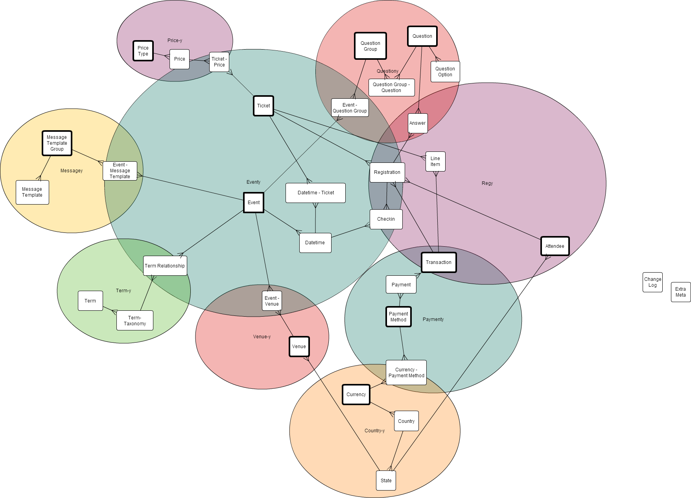

# Querying Data using the Event Espresso Model System

## What is an EE4 Model?

Models are class singletons (PHP objects which are special in that there only one can exist at a time) used for defining and interacting with database tables. Each EE4 model usually corresponds to a single mysql database table. Each model defines a set of "fields" which correspond to database columns, and a set of "relations" which corresponds to other tables to which the model's table can be joined. Information corresponding to the model's tables, fields, and relations can be found in the in the model's constructor. Eg, to learn what mysql tables `EEM_Registration` uses, or what fields it has, or what other models its related to, look in `EEM_Registration::__construct()`.

## What models exist?

The model classes are all contained in the Event Espresso 4 plugins' `core/db_models` directory. There are quite a few of them. The following Ven Diagram shows all the models (in EE 4.6) and how they relate to each other. Each box is a model; each line shows a relation (the model with multiple lines coming out of it converging into one is the one with the foreign key to the other), and each differently-coloured bubble just helps to identify models with similar purposes.



> **Note:** the `Extra_Meta` and `Change_Log` models are special in that they can actually related to ALL other models.

## How to use the Model Singletons

To access the classes for querying, use the model singletons (there are no globals to use). This can be done with:

```php
EEM_Event::instance()
```

This returns the singleton, which can be used for querying. All the models are located in our core/db_models directory. Also note that all the models are autoloaded, meaning there is no need to `include` them.

## Corresponding Table(s)

The table (or tables) corresponding to the model are stored on `EEM_Base::_tables` array. Eg, on `EEM_Registration` the tables are:

```php
$this->_tables = array(
    'Registration' => new EE_Primary_Table( 'esp_registration', 'REG_ID' )
);
```

The first argument provided to EE_Primary_Table is the name of the database table (minus the `$wpdb->prefix`), and the 2nd argument is the primary key on the table. The array key used is also important though, as it will be the table's alias used when querying (why use an alias? Because we often need to make a join to the same table several times with different conditions). The convention is for the table's alias to usually be the same as the "model name".

There are cases where a model corresponds to multiple tables, which is the case for `EEM_Event`, `EEM_Venue`, and `EEM_Attendee`. For example, on `EEM_Event`, the tables are:

```php
$this->_tables = array(
    'Event_CPT'=>new EE_Primary_Table( 'posts','ID' ),
    'Event_Meta'=> new EE_Secondary_Table( 'esp_event_meta', 'EVTM_ID', 'EVT_ID' )
);
```

`EEM_Event`, as you can see, uses the wordpress core 'posts' table and has a second table named 'esp_event_meta'. The second table stores other important information about events which didn't correspond nicely to the columns available on the posts table, but was queried on frequently enough that we felt using a skinny table (like Wordpress' postmeta table) would be both awkward and inefficient. The 2nd argument on `EE_Secondary_Table` is again that table's primary key, and the 3rd argument is its foreign key to the `EE_Primary_Table`. This second table is essentially an extension of the first one, and there is a one-to-one relation between the rows in both tables (ie, for each row in the posts table that represents an event, there should only ever be one row in the esp_event_meta table).

## Model fields

The model's fields are defined in the class' constructor. Eg, for `EEM_Registration` they are in `EEM_Registration::__construct()`. Here is an example

```php
$this->_fields = array(
    'Registration'=>array(
	'REG_ID' => new EE_Primary_Key_Int_Field( 'REG_ID', __( 'Registration ID','event_espresso' ) ),
	'EVT_ID' => new EE_Foreign_Key_Int_Field( 'EVT_ID', __( 'Even tID','event_espresso'), false, 0, 'Event'),
	'ATT_ID' => new EE_Foreign_Key_Int_Field( 'ATT_ID', __( 'Attendee ID','event_espresso'), false, 0, 'Attendee'),
	'TXN_ID' => new EE_Foreign_Key_Int_Field( 'TXN_ID', __( 'Transaction ID','event_espresso'), false, 0, 'Transaction'),
	'TKT_ID' => new EE_Foreign_Key_Int_Field( 'TKT_ID', __( 'Ticket ID','event_espresso'), false, 0, 'Ticket'),
	'STS_ID' => new EE_Foreign_Key_String_Field( 'STS_ID', __( 'Status ID','event_espresso'), false, EEM_Registration::status_id_pending_payment, 'Status'),
	'REG_date' => new EE_Datetime_Field( 'REG_date', __( 'Time registration occurred','event_espresso'), false, current_time('timestamp'), $timezone ),
	'REG_final_price' => new EE_Money_Field( 'REG_final_price', __( 'Final Price of registration','event_espresso'), false, 0),
	'REG_session' => new EE_Plain_Text_Field( 'REG_session', __( 'Session ID of registration','event_espresso'), false, ''),
	'REG_code' => new EE_Plain_Text_Field( 'REG_code', __( 'Unique Code for this registration','event_espresso'), false, ''),
	'REG_url_link' => new EE_Plain_Text_Field( 'REG_url_link', __( 'String to be used in URL for identifying registration','event_espresso'), false, ''),
	'REG_count' => new EE_Integer_Field( 'REG_count', __( 'Count of this registration in the group registraion ','event_espresso'), true, 1),
	'REG_group_size' => new EE_Integer_Field( 'REG_group_size', __( 'Number of registrations on this group','event_espresso'), false, 1),
	'REG_att_is_going' => new EE_Boolean_Field( 'REG_att_is_going', __( 'Flag indicating the registrant plans on attending','event_espresso'), false, false),
	'REG_deleted' => new EE_Trashed_Flag_Field( 'REG_deleted', __( 'Flag indicating if registration has been archived or not.', 'event_espresso'), false, false )
			)
		);
```

The top-level array key ('Registration') corresponds to the table alias, indicating that all these fields belong to the table with the alias 'Registration'. The next-level of array keys are the fields' names, and their values are classes which are children of `EE_Model_Field_Base`, which define (in order declared): the database table's column, an i18n string describing the field, whether the field can be NULL, the field's default value, and on `EE_Foreign_Key_Field_Base` children, the model, or models, pointed to by the field.

## Model Relations

The model's relations are also defined in the model class' constructor. Eg, on `EEM_Registartion` the relations are:

```php
$this->_model_relations = array(
	'Event' => new EE_Belongs_To_Relation(),
	'Attendee' => new EE_Belongs_To_Relation(),
	'Transaction' => new EE_Belongs_To_Relation(),
	'Ticket' => new EE_Belongs_To_Relation(),
	'Status' => new EE_Belongs_To_Relation(),
	'Answer' => new EE_Has_Many_Relation(),
	'Checkin' => new EE_Has_Many_Relation()
);
```

This means that each registration should belong to one event, one attendee, one transaction, one ticket, and one status. It may also have many answers or checkin records. Note that the array keys, which is also the relation's name, MUST be the model's name (ie, the model class' name, eg. `EEM_Event`, minus 'EEM_', eg 'Event').

The main relation types are:

* `EE_Belongs_To_Relation` - this model has a foreign key to the other model (so in the example above, that indicates `EEM_Registration` should have a foreign key to `EEM_Event`, `EEM_Attendee`, `EEM_Transaction`, `EEM_Ticket` and `EEM_Status`). This also means model objects of this type can only possibly have ONE model object of the other type; eg each EE_Registration can only have one related event
* `EE_Has_Many_Relation` - the other model has a foreign key to this (so in the example above, that indicates `EEM_Answer` and `EEM_Checkin` should each have a foreign key to `EEM_Registration`). This means that this model objects of this type can have many related model objects of the other type; eg each EE_Registration can have many answers and many checkins
* `EE_HABTM_Relation` - "HABTM" stands for "Has-And-Belongs-To-Many". This is one is special that it must specify third model to join between this model and the other; both this model and the other model have a has-many relation to the join model. Eg, `EEM_Event` has an `EE_HABTM_Relation` to `EEM_Venue` via the `EEM_Event_Venue` model. That `EEM_Event_Venue` model is a join model which just has a primary key, a foreign key field to `EEM_Event` and another foreign key to `EEM_Venue`.

## Default Where Conditions

The astute reader might have noted that if `EEM_Event`, `EEM_Venue` and `EEM_Attendee` all use the Wordpress posts table, doesn't that mean when we make a query on one of those models it should return posts of ALL types by default? (Not just posts of the type corresponding to the model,eg. 'espresso_events' for `EEM_Event`?) Yes they would if it were not for the `EE_Default_Where_Conditions`. If there are any, these are also defined in each model's constructor and generate default WHERE clauses when running database queries. There are two children of `EE_Default_Where_Conditions` used so far:

1. `EE_CPT_Where_Conditions` which limits the results to only those where: the post_type is of the type specified, there is entry in the corresponding 2nd table, and the post_status isn't 'auto-draft' or 'trash'. Usually models extending `EEM_CPT_Base` (which is also a child of `EEM_Base`) use this. This means that when querying a child of `EEM_CPT_Base`, by default you'll only get posts of the right type that aren't trashed or just drafts.
2. `EE_Soft_Delete_Where_Conditions` limits results to only those where the model's `EE_Trashed_Flag_Field` (eg on `EEM_Registration` that was 'REG_deleted') is set to FALSE (meaning NOT deleted). Usually models extending `EEM_Soft_Delete_Base` (which is also a child of `EEM_Base`) use this. This means that when queryign a child of `EEM_Soft_Delete_Base`, by default you'll only get database rows which aren't trashed.

You may override these default where conditions by specifying a different value for the field in the query, or by disabling default where conditions. For example, to get both deleted and non-deleted registrations from the database, you could perform any of the following queries:

```php
EEM_Registration::instance()->get_all( array( array( 'REG_deleted' => array( 'IN', array( TRUE, FALSE ) ) ) ) );//directly overrides the default where condition
EEM_Registration::instance()->get_all_deleted_and_undeleted();//uses wrapper method on EEM_Soft_Delete_Base which does the exact same as above, 
EEM_Registration::instance()->get_all( array( 'default_where_conditions' => 'other_models_only' ) );//disables the usage of default where conditions on this model, but if we were to join to other models they would still be used
```

## Retrieving Data

### get_all()

```
EEM_Base::get_all($query_params = array())
```

Basic method for retrieving model objects from a model.
#### Parameters
##### $query_params
`array` Documented in [Model Query Params Documentation](model-query-params.md).

##### Returns
`EE_Base_Class[]` Array of [model objects](using-ee4-model-objects.md) of the corresponding type. Eg `EEM_Event::get_all()` will return an array of `EE_Event` objects `EEM_Venue::get_all()` will return an array of `EE_Venue` objects, `EEM_Question::get_all()` will return an array of `EE_Question` objects, etc.

#### Examples
To get all events and print their names, use the `EEM_Event::get_all()` like so:

```php
$events = EEM_Event::instance()->get_all();
foreach( $events as $event ) {
    echo $event->name()."<br>";
}
```

Notice that the method is not static: it must be called on the event model singleton, obtained from `EEM_Event::instance()`. Calling it statically, ie `EEM_Event::get_all()` will *not* work.

Here are a few other examples to give you a taste for what the `EEM_Base::get_all()` method can do for you:

```php
EEM_Event::instance()->get_all(
    array(
       'limit' => 10,
       'order_by' => array( 'EVT_visible_on' => 'DESC' ),
        array( 
            'EVT_visible_on' => array( '>', current_time() )
        )
    )
);
```

This gets the 10 next events to be visible on the website. Magically takes care of joining the wp_posts table (containing the espresso_events custom post type (CPT) event data) with the wp_esp_event_meta table (containing the date the event should be visible and other other easily-queryable-metadata)

```php
EEM_Event::instance()->get_all( array( array( 'Venue.State.STA_name' => 'Idaho' ) );
```

This gets all events held in Idaho. Magically joins the posts table to the event meta table, to the post table again (filtering for venue CPTs) to the venue meta table, to the state table.

```php
EEM_Venue::instance()->get_all(
    array(
        array(
            'OR' => array(
                 'VNU_wp_user' => 1,
                 'Term_Taxonomy.Term.slug' => array( 'LIKE', '%user_1%' )
                )
         )
     )
);
```            

This gets all venues created by user with ID 1 or have a term containing the string 'user_1'.

There are many variations of `EEM_Base::get_all()`, which simplify certain common tasks...

### get_all_wpdb_results()

```
get_all_wpdb_results($query_params = array(), $output = ARRAY_A, $columns_to_select = null)
```

Similar to `get_all()`, except it returns an array exactly like `$wpdb->get_results()` would return (see [WordPress' documentation on $wpdb](https://codex.wordpress.org/Class_Reference/wpdb#SELECT_Generic_Results)).
This is useful in cases where speed is a top priority, as this skips a processing step.
#### Parameters
##### $query_params
`array` Documented in [Model Query Params Documentation](model-query-params.md).

##### $output
One of four pre-defined constants. Please [read the WPDB documentation on $output_type](https://codex.wordpress.org/Class_Reference/wpdb#SELECT_Generic_Results).

##### $columns_to_select
(mixed)What columns to select. By default, we select all columns specified by the fields on the model, and the models we joined to in the query. 
However, you can override this and set the select to "*", or a specific column name, like "ATT_ID", etc. 
If you would like to use these custom selections in WHERE, GROUP_BY, or HAVING clauses, you must instead provide an array. 
Array keys are the aliases used to refer to this selection, and values are to be numerically-indexed arrays, where 0 is the selection and 1 is the data type. 
Eg, array('count'=>array('COUNT(REG_ID)','%d')) 

#### Returns
`array | stdClass[]` like results of $wpdb->get_results($sql,OBJECT), (ie, output type is OBJECT)

#### Examples
Gets all events, but as an array of arrays (whereas `EEM_Base::get_all()` would have gotten model objects).

```php
$event_arrays = EEM_Event::instance()->get_all_wpdb_results();
```

Gets a count of registrations per day, for an event in 

```php
$dates_and_totals = EEM_Registration::instance()->get_all_wpdb_results(
        array(
            $where,
            'group_by' => 'regDate',
            'order_by' => array('REG_date' => 'ASC'),
        ),
        OBJECT,
        array(
            'regDate' => array('DATE(REG_date)', '%s'),
            'total' => array('count(REG_ID)', '%d'),
        )
   );
```

### get_one()

```php
EEM_Base::get_one($query_params = array())
```

This is exactly like get_all, but only returns the first model object found instead of an array of them.

#### Parameters
##### $query_params
`array` Documented in [Model Query Params Documentation](model-query-params.md). Only slight modification: the key "limit" is overridden to always return exactly one item.

#### Returns
`EE_Base_Class | null` [Model objects](using-ee4-model-objects.md) of the corresponding type

#### Examples

```php
//gets the first attendee found who's name is john
$an_attendee = EEM_Attendee::instance()->get_one( array( array( 'ATT_fname' => 'John' ) );
```

### get_one_by_ID()

```php
EEM_Base::get_one_by_ID($id)
```
This is exactly like using EEM_Event::instance()->get_one( array( array( 'EVT_ID' => 234 ), 'default_where_conditions' => 'other_models_only' ) );  Eg.
Because you have the ID of the item you're looking for, default where conditions are not used on the model being queried. This means the item could be trashed and it will be returned just fine.

##### $id
int|string The ID of the model object you want to retrieve.

#### Returns
`EE_Base_Class | null` [Model objects](using-ee4-model-objects.md) of the corresponding type

#### Examples
```php
$registration_234 = EEM_Registration::instance()->get_one_by_ID( 234 );
```

### get_all_copies()

```php
EEM_Base::get_all_copies($model_object_or_attributes_array, $query_params = array())
```
When this is passed a model object it gets all model objects which appear to be copies of it (exact same data except their primary key).

#### Parameters
##### $model_object_or_attributes_array
array|EE_Base_Class $model_object_or_attributes_array If its an array, it's field-value pairs

##### $query_params
`array` Documented in [Model Query Params Documentation](model-query-params.md).

#### Returns
`EE_Base_Class[]` Array of [model objects](using-ee4-model-objects.md) of the corresponding type. Eg `EEM_Event::get_all()` will return an array of `EE_Event` objects `EEM_Venue::get_all()` will return an array of `EE_Venue` objects, `EEM_Question::get_all()` will return an array of `EE_Question` objects, etc.

#### Examples

```php
$att1 = EEM_Attendee::instance()->get_one();
$duplicate_attendees = EEM_Attendee::instance()->get_all_copies( $att1 );
```
 
### get_one_conflicting()

```php
EEM_Base::get_one_conflicting($obj_or_fields_array, $include_primary_key = true)
```

When this is passed a model object it returns the first model object in the database that would somehow conflict with it (based on uniqueness conditions like keys and indexes). Eg.

#### Parameters
##### $obj_or_fields_array
`EE_Base_Class | array` if an array, then its keys are the model's fields names and array values are their values.

##### $include_primary_key
`boolean` whether to use the model object's primary key when looking for conflicts (ie, if false, we ignore the model object's primary key when finding "conflicts". If true, it's also considered). Only works for INT primary key, STRING primary keys cannot be ignore.

#### Returns
`EE_Base_Class | null` A model object if one was found, otherwise null.

#### Examples

```php
$proposed_event = EE_Event::new_instance( array( 'EVT_slug' => 'hockey-game' ) );
//check for conflicting events with that slug...
$conflicting_events = EEM_Event::instance()->get_one_conflicting( $proposed_event );
//if no conflicts exist, save it
if( ! $conflicting_events ){
    $proposed_event->save();
}
```

(see the [model objects docs](using-ee4-model-objects.md) for info on EE_Event::new_instance(...) and the save() method)

### count()

```php
EEM_Base::count($query_params = array(), $field_to_count = null, $distinct = false)
```
This is passed the exact same query_params array as get_all, but only returns a count of all the rows get_all would have found.

#### Parameters
##### $query_params
`array` Documented in [Model Query Params Documentation](model-query-params.md).

##### $field_to_count
`string` field on model to count by (not column name)

##### $distinct
`boolean` if we want to only count the distinct values for the column then you can trigger that by the setting $distinct to TRUE.

#### Returns
`int` The MySQL count (note that this is affected by the value of `$field_to_count` and `$distinct`.)

#### Examples

```php
//counts all the unique attendees for event 123
$count_unique_attendee_for_event = EEM_Attendee::instance()->count(
    array(
        array( 'Registration.EVT_ID' => 123 )
        )
);
```

### exists()

```php
EEM_Base::exists($query_params)
```
This method is like count, but simply returns a boolean indicating whether anything was found or not.

#### Parameters
##### $query_params
`array` Documented in [Model Query Params Documentation](model-query-params.md).

#### Returns
`boolean` Whether or not any model object exists matching the query parameters.

#### Examples

```php
//checks if ticket 345 was purchased at all
$ticket_345_purchased = EEM_Registration::instance()->exists(
    array(
        array( 'Ticket.TKT_ID' => 345 )
    )
);
```

### sum()

```php
EEM_Base::sum($query_params, $field_to_sum = null)
```
When this is passed a field name and query_params array it returns the sum of all the model objects' specified field.

#### Parameters
##### $query_params
`array` Documented in [Model Query Params Documentation](model-query-params.md).

##### $field_to_sum
`string` Name of the field to sum.

#### Returns
`float` The summed total.

#### Examples

```php
//finds the revenue generated for an event
$money_made_on_event_123 = EEM_Transaction::instance()->sum(
    array(
        array(
            'Registration.EVT_ID' => 123,
            'STS_ID' => array(
                'IN', array(
                        EEM_Transaction::complete_status_code,
                        EEM_Transaction:::overpaid_status_code ) ) ) ),
   'TXN_total' ) );
```

## Inserting Data

### Insert()

```php
EEM_Base::insert($field_n_values)
```
Used to insert data directly into the database. Usually it would be better to [create a model object and save it](using-ee4-model-objects.md), but this can be slightly more performant.

#### Parameters
##### $fields_n_values
`array` keys are field names, values are the desired values. Note: these values should already be in the format model objects return.

#### Returns
`int | string` New primary key of the inserted item.

#### Examples

```php
//inserts a new attendee in the wp_esp_attendee table. 
//Explicitly sets the firstname, lastname and email, and leave everything as the default values
$new_attendee_id = EEM_Attendee::instance()->insert(
    array(
        'ATT_fname' => 'bill',
        'ATT_lname' => 'smith',
        'ATT_email' => 'few@ew.ew'));
```

However, the preferred method for inserting items into the database is to create a model object and save it, because model objects may set certain default field values upon construction. Eg

```php
//the new attendee's constructor sets the ATT_full_name and other fields whose defaults can be derived from fields provided to new_instance()
$new_attendee = EE_Attendee::new_instance(
    array(
        'ATT_fname' => 'bill',
        'ATT_lname' => 'smith',
        'ATT_email' => 'few@ew.ew'));
//and now we save it to the database (uses EEM_Attendee::insert internally)
$new_attendee->save();
```

## Updating

### update()

```php
EEM_Base::update($fields_n_values, $query_params, $keep_model_objs_in_sync = true)
```
Updates existing data, Usually it would be better to [retrieve a model object and save it](using-ee4-model-objects.md), but this can be slightly more performant.

#### Parameters
##### $fields_n_values
`array` Keys are field names, values are their desired values (put in the format returned by model objects).

##### $query_params
`array` Documented in [Model Query Params Documentation](model-query-params.md).

#### Returns
`int` How many database rows were affected.

#### Examples

```php
//changes all registrations for event 111 to instead be for event 222
EEM_Registration::instance()->update(
    array(
        'EVT_ID' => 222 ),
    array(
        array( 'EVT_ID' => 111 ) );
```

## Deleting

### delete()

```php
EEM_Base::delete($query_params, $allow_blocking = true)
```

"Deletes" the matched model objects. For models that allow "soft deletion" or "trashing" will instead only trash them.

#### Parameters
##### $query_params
`array` Documented in [Model Query Params Documentation](model-query-params.md).

##### $allow_blocking
`boolean` Only applies to soft-deletion/trashing. If set to true, model objects will not be deleted if there is another model object with a foreign key to the
item that would have been deleted. 

#### Returns
`int` The number of rows affected.

#### Examples

Permanently deletes all answers for question 123
```php
$count_items_deleted = EEM_Answer::instance()->delete( array( array( 'QST_ID' => 123 )));
```

Trashes all events with name "Foobar"
```php
$count_events_trashed = EEM_Event::instance()->delete(array(array('EVT_name'=>'Foobar')));
```

Permanently deletes transactions with a total lower than 10, provided there are no registrations or payments for them.
```php
$count_transactions_deleted = EEM_Transaction::instance()->delete(array(array('TXN_total' => array('>', 10)));
```

### delete_permanently()

```php
EEM_Base::delete_permanently($query_params, $allow_blocking = true)
```

Permanently deletes the matched model objects, even for models that allow "soft deletion" or "trashing".
For non-soft-deletable model objects, this is the same as `delete()`.

#### Parameters
##### $query_params
`array` Documented in [Model Query Params Documentation](model-query-params.md).

##### $allow_blocking
`boolean` If set to true, model objects will not be deleted if there is another model object with a foreign key to the
item that would have been deleted. 

#### Returns
`int` The number of rows affected.

#### Examples

Permanently deletes all answers for question 123 (just like `delete()` would)
```php 
$count_items_deleted = EEM_Answer::instance()->delete_permanently( array( array( 'QST_ID' => 123 )));
```

Permannetly deletes all events with name "Foobar" (doesn't just trash them).
```php
$count_events_trashed = EEM_Event::instance()->delete_permanently(array(array('EVT_name'=>'Foobar')));
```

Permanently deletes transactions with a total lower than 10, provided there are no registrations or payments for them.
```php
$count_transactions_deleted = EEM_Transaction::instance()->delete_permanently(array(array('TXN_total' => array('>', 10)));
```

## Inspecting Generated Queries

After you've started generating queries using the EE models system, you'll probably want to know exactly what SQL is getting generated. To do this, use the `show_next_x_db_queries()` function on the model you want to debug like so:

```php
//creates a fairly complex SQL query (gets 10 events (after first 40) which have a payment over a dollar) and echoes it out
EEM_Event::instance()->show_next_x_db_queries(1);
EEM_Event::instance()->get_all( 
    array( 
        array( 
            'Registration.Transaction.Payment.PAY_amount' => array( '>' , 1.00 ) ),
        'limit' => array( 40, 10 ) ) );
```

and the next 1 query will be echoed out to the page, which in this case is:

```sql
SELECT 
    Event_CPT.ID AS 'Event_CPT.ID', Event_CPT.post_title AS 'Event_CPT.post_title', Event_CPT.post_content AS 'Event_CPT.post_content', Event_CPT.post_name AS 'Event_CPT.post_name', Event_CPT.post_date AS 'Event_CPT.post_date', Event_CPT.post_excerpt AS 'Event_CPT.post_excerpt', Event_CPT.post_modified AS 'Event_CPT.post_modified', Event_CPT.post_author AS 'Event_CPT.post_author', Event_CPT.post_parent AS 'Event_CPT.post_parent', Event_CPT.menu_order AS 'Event_CPT.menu_order', Event_CPT.post_status AS 'Event_CPT.post_status', Event_Meta.EVT_display_desc AS 'Event_Meta.EVT_display_desc', Event_Meta.EVT_display_ticket_selector AS 'Event_Meta.EVT_display_ticket_selector', Event_Meta.EVT_visible_on AS 'Event_Meta.EVT_visible_on', Event_Meta.EVT_additional_limit AS 'Event_Meta.EVT_additional_limit', Event_Meta.EVT_default_registration_status AS 'Event_Meta.EVT_default_registration_status', Event_Meta.EVT_member_only AS 'Event_Meta.EVT_member_only', Event_Meta.EVT_phone AS 'Event_Meta.EVT_phone', Event_Meta.EVT_allow_overflow AS 'Event_Meta.EVT_allow_overflow', Event_Meta.EVT_timezone_string AS 'Event_Meta.EVT_timezone_string', Event_Meta.EVT_external_URL AS 'Event_Meta.EVT_external_URL', Event_Meta.EVT_donations AS 'Event_Meta.EVT_donations', Event_CPT.ID AS 'Event_CPT.ID', Event_Meta.EVTM_ID AS 'Event_Meta.EVTM_ID', Registration.REG_ID AS 'Registration.REG_ID', Registration.EVT_ID AS 'Registration.EVT_ID', Registration.ATT_ID AS 'Registration.ATT_ID', Registration.TXN_ID AS 'Registration.TXN_ID', Registration.TKT_ID AS 'Registration.TKT_ID', Registration.STS_ID AS 'Registration.STS_ID', Registration.REG_date AS 'Registration.REG_date', Registration.REG_final_price AS 'Registration.REG_final_price', Registration.REG_session AS 'Registration.REG_session', Registration.REG_code AS 'Registration.REG_code', Registration.REG_url_link AS 'Registration.REG_url_link', Registration.REG_count AS 'Registration.REG_count', Registration.REG_group_size AS 'Registration.REG_group_size', Registration.REG_att_is_going AS 'Registration.REG_att_is_going', Registration.REG_deleted AS 'Registration.REG_deleted', Transaction.TXN_ID AS 'Transaction.TXN_ID', Transaction.TXN_timestamp AS 'Transaction.TXN_timestamp', Transaction.TXN_total AS 'Transaction.TXN_total', Transaction.TXN_paid AS 'Transaction.TXN_paid', Transaction.STS_ID AS 'Transaction.STS_ID', Transaction.TXN_session_data AS 'Transaction.TXN_session_data', Transaction.TXN_hash_salt AS 'Transaction.TXN_hash_salt', Payment.PAY_ID AS 'Payment.PAY_ID', Payment.TXN_ID AS 'Payment.TXN_ID', Payment.STS_ID AS 'Payment.STS_ID', Payment.PAY_timestamp AS 'Payment.PAY_timestamp', Payment.PAY_method AS 'Payment.PAY_method', Payment.PAY_amount AS 'Payment.PAY_amount', Payment.PAY_gateway AS 'Payment.PAY_gateway', Payment.PAY_gateway_response AS 'Payment.PAY_gateway_response', Payment.PAY_txn_id_chq_nmbr AS 'Payment.PAY_txn_id_chq_nmbr', Payment.PAY_po_number AS 'Payment.PAY_po_number', Payment.PAY_extra_accntng AS 'Payment.PAY_extra_accntng', Payment.PAY_via_admin AS 'Payment.PAY_via_admin', Payment.PAY_details AS 'Payment.PAY_details' 
FROM 
    wp_posts AS Event_CPT LEFT JOIN 
    wp_esp_event_meta AS Event_Meta ON Event_CPT.ID = Event_Meta.EVT_ID LEFT JOIN 
    wp_esp_registration AS Registration ON Registration.EVT_ID=Event_CPT.ID LEFT JOIN 
    wp_esp_transaction AS Transaction ON Transaction.TXN_ID=Registration.TXN_ID LEFT JOIN 
    wp_esp_payment AS Payment ON Payment.TXN_ID=Transaction.TXN_ID 
WHERE 
    Event_CPT.post_type = 'espresso_events' AND 
    Event_CPT.post_status NOT IN ('auto-draft','trash') AND 
    ( (Registration.REG_deleted = 0) OR Registration.REG_ID IS NULL) AND 
    Payment.PAY_amount > 1.000000 
LIMIT 40,10
```

## Querying Datetime Fields

Querying datetime fields (e.g., an Event's `EVT_created`, or an Event's Datetime's `DTT_EVT_start`) requires a bit of explaining.

When passing in a value for one of those fields, you can can in either a `DbSafeDateTime` object (which extends the standard `DateTime`), a unix timestamp integer, or a string in the site's WordPress date and time format.

### Providing DbSafeDateTime objects for Datetime Fields in Queries
The recommended way to pass a time into a query is as a `DbSafeDatetime` object. These objects are autoloaded by Event Espresso, and extend PHP's standard `DateTime` object, so you can use them anywhere just like a normal `DateTime` object. (The only reason we don't recommend passing in a standard `DateTime` object is because they don't serialize well.) This format is best when you want to use a specific timezone and known date.


Here is an example that gets all events created before the start of 2017, who have an event that started over a year from the current time

```
$events = EEM_Event::instance()->get_all(
                array(
                    array(
                        'EVT_created' => array('<', new \EventEspresso\core\domain\entities\DbSafeDateTime('2017-01-01', new DateTimeZone('America/New_York'))),
                        'Datetime.DTT_EVT_start' => array('>', new \EventEspresso\core\domain\entities\DbSafeDateTime('1 year ago', new DateTimeZone('America/New_York')))
                    )
                )
            );
```

### Providing a Unix Timestamp for Datetime Fields in Queries
You can also pass in a unix timestamp while querying datetime fields. This format is probably the simplest to use, but you must ensure the times are in UTC (part of the definition of a unix timestamp). 

Here is an example that fetches all registrations between two dates defined by unix timestamps
```
$registrations = EEM_Registration::instance()->get_all(
                array(
                    array(
                        'REG_date' => array(
                            'BETWEEN',
                            array(
                                //October 10th, 2017 @ 21:10:38 GMT
                                1507756239,
                                //November 11th, 2017 @ 21:12:28 GMT
                                1510434638

                            ))
                    )
                )
            );
```

Also, if you want to query for events with a future start date, you can use `EEM_Base::current_time_for_query()` function in queries as follows:

```
 $events = EEM_Event::instance()->get_all(
                array(
                    array(
                        'Datetime.DTT_EVT_start' => array(
                            '>',
                            EEM_Datetime::instance()->current_time_for_query('DTT_EVT_start')
                        )
                    )
                )
            );
```

Note that `current_time_for_query` is called on which ever model has the specified field. In this case, because `DTT_EVT_start` is on `EEM_Datetime`, we used `EEM_Datetime::instance()->current_time_for_query('DTT_EVT_start')`. Had we used the model `EEM_Event`, there would have been an error because there is no field named `DTT_EVT_start` on that model.


### Providing a String in the WordPress Date and Time format for Datetime Fields in Queries
Lastly, you can pass in a string for a datetime field's value, but you must ensure it is in the WordPress timezone, and matches the WordPress Date/Time formats. This is most convenient when you have user input coming in that's already in the WordPress timezone and Date/Time formats.

Here is an example where we get all payments between March 1st at 11PM and March 20th at 11PM in the site's timezone (whatever it may be) ASSUMING the site's Date format is `F jS, Y,` and its Time format is `H:i`. E.g. https://s.nimbus.everhelper.me/share/1172792/07uc2y8f9e5tfhg0nv63
```
$payments = EEM_Payment::instance()->get_all(
                array(
                    array(
                        'PAY_timestamp' => array(
                            'BETWEEN',
                            array(
                                'March 1st, 2016, 23:00',
                                'March 20th, 2016, 23:00'
                            )
                        )
                    )
                )
            );
```
	


Please read [the documentation specifically about dates and times in Event Espresso](https://github.com/eventespresso/event-espresso-core/blob/master/docs/F--Datetime-System/dates-times-timezones-in-models.md) for related information on dealing with datetime fields on model objects, and see ]our developer blog post](http://developer.eventespresso.com/important-changes-to-ee-datetime-system-coming-to-ee/) about helper functions for working with datetimes.
