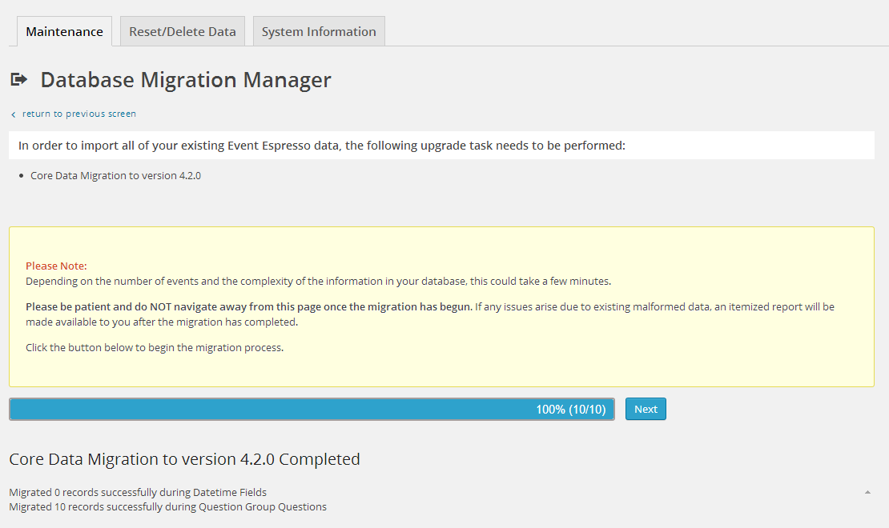

# Data Migration Scripts: An Overview

Often when a new version of Event Espresso is released, there are changes that need to be made to the database tables. These changes often make data from the old database tables unusable unless it is modified to be compatible with the newest version of EE. That is the job of data migration scripts or DMSs. Each DMS describes how to modify the database data to make it compatible with the next version of EE. When it is found that a DMS needs to be run, EE is temporarily put in [Maintenance Mode](ee-maintenance-mode.md) until the needed migrations are run. On some servers we could simply run all the migration scripts in the background automatically, but these often take longer than 30 seconds and most hosts would have a PHP timeout. Instead, we run the DMSs in small steps on AJAX requests.

This article discusses data migration scripts in EE core and explains how addons can add DMSs to migrate their own data.

## Data Migration Scripts (DMSs) in EE Core

### `EE_Data_Migration_Script_Base`

EE4 core detects when an update has occurred. Then it checks to see if any data migration scripts should be run. To make EE4 core aware of data migration scripts, they are placed in the following folder core/data_migration_scripts and the files are named EE_DMS_*.dms.php, where * is firstly a slug indicating the migration applies to 'Core', or an addon, such as the 'Calendar'. Then the first version the script migrates to  'EE_DMS_Core_4_1_0.dms.php'. Each DMS must be a child of EE_Data_Migration_Script_Base and must implement 3 abstract methods:

#### can_migrate_from_version($version_array)

This function passes an array with a key for each EE plugin slug in use and indicates the state that plugin's data is in (e.g. array('Core'=>'4.1.0','Calendar'=>'3.0.0')). Using this information, the function must decide if the migration script applies or not. Here is an example: EE_DMS_Core_4_2_0.dms.php checks that 'Core' is greater-than-or-equal-to '4.1.0', but less than '4.2.0' using php_version_compare().

#### schema_changes_before_migration()

This contains all the code that defines the changes that need to be made to the database schema in order for the data migration stages to run correctly.

#### schema_changes_after_migration()

After the data has been migrated, this method performs any cleanup database changes that are necessary. For example, you may add a column into a table during schema_changes_before_migration() and then move data from an old column to this new one and then during schema_changes_after_migration() you remove the old unnecessary column).

An example is [EE_DMS_Core_4_1_0.dms.php](https://github.com/eventespresso/event-espresso-core/blob/master/core/data_migration_scripts/EE_DMS_Core_4_1_0.dms.php) and [EE_DMS_Core_4_2_0.dms.php](https://github.com/eventespresso/event-espresso-core/blob/master/core/data_migration_scripts/EE_DMS_Core_4_2_0.dms.php) (the latter being a simpler than the former)

### Migration Stages: `EE_Data_Migration_Script_Stage_Table` and `EE_Data_Migration_Script_Stage` 

In addition, each EE_Data_Migration_Script_Base's constructor should define a _pretty_name and they may define an array of _migration_stages, children of EE_Data_Migration_Script_Stage or EE_Data_Migration_Script_Stage_Table, which describe how to migrate specific data from the old version. Small AJAX requests are used to migrate data to avoid PHP timeouts and to report migration progress to users. These are called migration steps.

EE_Data_Migration_Script_Stage_Table is well suited for migrating data from an old custom table and EE_Data_Migration_Script_Stage is generally applicable (e.g. migrating data from a WordPress option or statically-defined data).

### `EE_Data_Migration_Script_Stage_Table`

If the stage inherits from EE_Data_Migration_Script_Stage_Table, it must define the property _old_table which should be the complete name of the old database table to migrate e.g. 'wp_esp_answer', and must implement the following abstract method:

#### _migrate_old_row($old_row)

Takes an argument of an array from a single row of data from the old table (e.g. the results from $wpdb->get_row($sql,ARRAY_A)), and should migrate that row.

Examples: [EE_DMS_4_1_0_answers.stage.php](https://github.com/eventespresso/event-espresso-core/blob/master/core/data_migration_scripts/4_1_0_stages/EE_DMS_4_1_0_answers.dmsstage.php) and  [EE_DMS_4_1_0_attendee.stage.php](https://github.com/eventespresso/event-espresso-core/blob/master/core/data_migration_scripts/4_1_0_stages/EE_DMS_4_1_0_attendees.dmsstage.php)

### `EE_Data_Migration_Script_Stage` 

Each EE_Data_Migration_Script_Stage child must implement the following abstract methods:

#### _migration_step($num_items)

Receives an argument of the number of items to migrate at a time.

#### _count_records_to_migrate()

Counts the number of items to migrate during this stage.

Examples: [EE_DMS_4_1_0_org_options.stage.php](https://github.com/eventespresso/event-espresso-core/blob/master/core/data_migration_scripts/4_1_0_stages/EE_DMS_4_1_0_org_options.dmsstage.php) and [EE_DMS_4_1_0_gateways.stage.php](https://github.com/eventespresso/event-espresso-core/blob/master/core/data_migration_scripts/4_1_0_stages/EE_DMS_4_1_0_gateways.dmsstage.php)

## Useful Helper Methods:

### `EE_Data_Migration_Class_Base`, parent of both `EE_Data_Migration_Script_Base` and `EE_Data_Migration_Script_Stage`

#### count_records_migrated()

Counts the total records migrated so far. On the migration script, this is the total of all its stages.

#### count_records_to_migrate()

Counts the total records to migrate before this script or stage is finished. On the migration script, this is the total of all its stages.

#### add_error($message)

Records that a minor error occurred. This is for logging purposes, as this is non-fatal (if the error means that the migration cannot continue, use set_borked()).

#### get_status()

Gets the status of the script or stage. You may also like to use of its wrappers: is_borked(), has_more_to_do(), and is_completed().

#### set_status($new_status)

Sets the status of this script or stage. Note: setting the status of EE_Data_Migration_Manager::status_fatal_error on a migration stage will also mark the script as borked. ("borked", meaning "broken"). See related set_borked() and set_completed().

#### _create_error_message_for_db_insertion($old_table, $old_row_as_array, $new_table, $new_row_as_array, $datatypes)

Wrapper around add_error(), which is just for convenience when reporting an error when inserting a row.

### `EE_Data_Migration_Script_Base` Only

####_table_should_exist_previously($table_name,$table_definition_sql,$engine_string)

Primarily used in schema_changes_before_migration() to define a table that should previously have existed before this version.

#### _table_is_new_in_this_version($table_name,$table_definition_sql,$engine_string)

Similar to _table_should_exist_previously, but indicates that the table should be new in this version. The distinction is subtle but important, because if the table should be new in this version, and somehow is already in the user's database, the data is assumed to be erroneous and is removed (this can occur when using some database backup programs, which don't remove old tables when restoring to a backup).

#### set_mapping($old_table,$old_pk,$new_table,$new_pk)

While migrating data from an old table to a new table, it's important to maintain a map between old primary keys and new primary keys. That's what this function does. Used in combination with get_mapping_new_pk and get_mapping_old_pk. This data is automatically saved, and is even available after the migration script has finished.

#### get_mapping_new_pk($old_table,$old_pk,$new_table)

Gets the new primary key in the new table for the old table and old primary key provided.

#### get_mapping_old_pk($old_table,$new_table,$new_pk)

Gets the old primary key in the old table for the new table and new primary key provided.

### `EE_Data_Migration_Script_Stage` Only

#### get_migration_script()

Gets the data migration script which this stage is a part of. This is especially useful in order to gain access to the migration script's mappings.

## Other Important Info about Migration Scripts

Migration scripts should seek to be as independent from the rest of the codebase as possible. This is because it's possible that your migration script will be run on a version of EE that it does NOT migrate to (e.g. the 4.1.0 DMS is also used in EE 4.3.0). Each DMS is designed to only migrate a single minor version (e.g. migrate from 4.1 to 4.2, or 4.2 to 4.3 -- NOT 4.1 to 4.3 directly). So, to migrate from 4.1.0 to 4.3.0, first the 4.2.0 DMS is run, and then the 4.3.0 DMS is run afterwards.

An important aspect of making each DMS independent of the rest of the codebase is that DMSs should actually NOT use our model system, but should instead only rely on $wpdb. This is because changes to our models are likely to happen, whereas [$wpdb](https://codex.wordpress.org/Class_Reference/wpdb) is much less likely to have changes and break our DMSs.

## Data Migration Scripts (DMSs) in EE Addons

Migrations in addons are nearly identical except that you must register them with core using either EE_Addon or the filter FHEE__EE_Data_Migration_Manager__get_data_migration_script_folders. Also, when implementing the DMS's can_migrate_from_version method, they should use their own 'slug' instead of 'Core'. For example, if you write a DMS called EE_DMS_Foobar_1_4_0.dms.php, you should use the string 'Foobar' instead of 'Core'. You may want to consider the 'Core' version number as well when deciding whether your DMS applies or not (e.g. your Foobar migration to version to 1.4.0 may require Core to be at version 4.4.0, because before Core 4.4.0 an essential table was not yet present for your addon).

 

