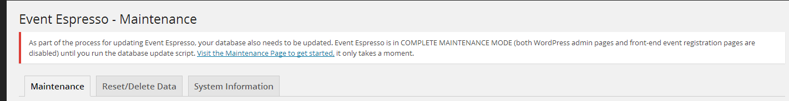
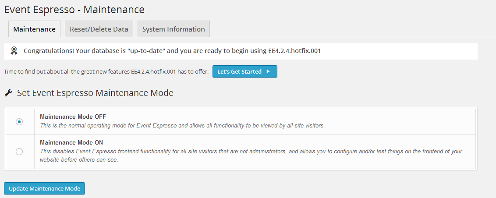

# EE Maintenance Mode



When it is found that a [data migration script](data-migration-scripts.md) needs to run, an Event Espresso 4 site is put into Complete Maintenance Mode (level 2). The means that EE's data is out-of-date from the code and needs to be migrated before EE is fully usable again. While EE is in maintenance mode, EE's custom tables and models used to access them cannot be used because they may not exist or could be out-of-date. After the migration scripts have been run by a site admin, EE is taken out of complete maintenance mode and is again ready for use.

A site admin can put their site into frontend-only maintenance mode (level 1) from the maintenance page (when not already in complete maintenance mode). 



This means that the frontend EE pages appear to be in maintenance mode to non-admins, but admins see them as normal.

## How Maintenance Mode Affects Your Code

Just because EE is active DOES NOT mean it is safe to run database queries on EE custom tables or use EE models. (i.e. the site was put into Complete Maintenance Mode (level 2) because the database is out-of-date). Before running any database queries, its best to check for maintenance mode. Here is an example of how this can be done:

```php
function foobar(){
    if ( MaintenanceStatus::isDisabled() ) {
        //we're not in maintenance mode at all, run anything
    } else if ( MaintenanceStatus::isPublicOnly() ) {
        //we may want to consider if this is a frontend or backend request
        //if frontend, we probably don't want to do much besides inform the user the site is in maintenance mode and to come back later
        //if in the backend, we probably still want to behave normally
    } else if ( MaintenanceStatus::isFullSite() ) {
        //we probably shouldn't do anything at all. We should also actually make sure our admin pages aren't even added until we're out of maintenance mode
    }
}
add_action('AHEE__EE_System__detect_if_activation_or_upgrade__complete','foobar');
```

Also, notice that this code is `AHEE__EE_System__detect_if_activation_or_upgrade__complete hook` (which is fired during the plugins_loaded action). This is the earliest point at which you can check to see if the site is in maintenance mode. You can also check for maintenance mode at a later point.

This means that addons will generally need to be loaded in "baby steps" just like EE core. You'll probably want to register your addon using EE_Addon quite early (on the "AHEE__EE_System__load_espresso_addons" action), but wait for 'AHEE__EE_System__detect_if_activation_or_upgrade__complete ' (preferably until the 'init' action) to begin querying the database.
