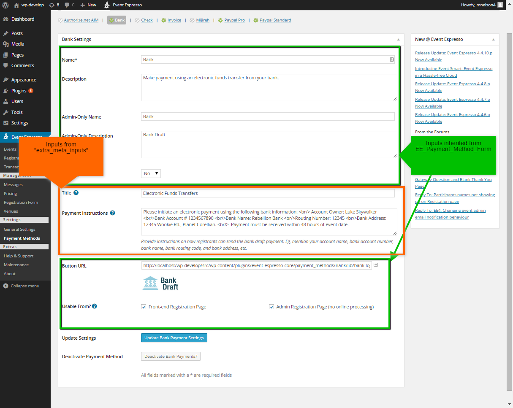
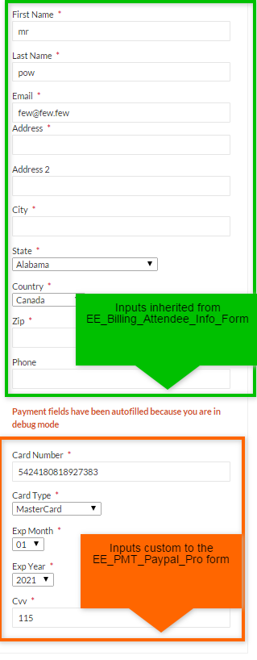

# Creating a Payment Method

This section describes how to develop a payment method from scratch, and is useful knowledge. However, when it comes time to actually build it, you should read [How to Build a Payment Method using the Skeleton Folder](https://github.com/eventespresso/event-espresso-core/blob/master/docs/D--Addon-API/using-new-payment-method-addon-skeleton.md) to get a jump-start.

## Payment Method Properties to Set

To create your own Payment Method, you create a class which extends `EE_PMT_Base` (found in core/libraries/payment_methods).

In the constructor you should declare the value of the following properties:

| Property Name | Description |
| ------------- | ----------- |
`_requires_https` |  Boolean describing whether or not this payment method should only be used on a server that supports HTTPS.
`_gateway` | The EE_Gateway class which handles communicating with the payment processing site, or NULL
`_pretty_name` | Should be an i18n string that will be name of the payment method type as shown to users
`_default_description` | The default description of how customers use the payment method.
`_default_button_url` | The URL of the image which will be the default button image
`_has_billing_form` | Introduced in 4.8. Payment methods with an onsite gateway class set this to TRUE by default, and payment methods with an offsite gateway class or no gateway class set this to FALSE by default. Use this if you need to override the default.

## Abstract Methods to Implement

You must implement the two following methods:

### `generate_new_settings_form`

This method creates a new `EE_Payment_Method_Form` form ([click here to read more about EE4 forms](../J--EE4-Forms-System/ee-forms-system-overview.md)), which also takes an extra constructor argument called "extra_meta_inputs" which is just an array of form inputs for any extra data you need for your payment method to work (eg, Paypal ID, or any other settings you want to store). This is the form that will appear to the site admin when updating the payment method's settings. Eg:



The inputs with a green square surrounding them are part of the `EE_Payment_Method_Form`, whereas the ones with an orange square surrounding them are from the "extra_meta_inputs". When the form is saved, the `EE_Payment_Method_Form` takes care of saving each "extra_meta_input" in the esp_extra_meta table and associating it with the payment method.

That was generated by the `EE_Bank::generate_new_settings_form()` method:

```php
/**
 * Gets the form for all the settings related to this payment method type
 * @return EE_Payment_Method_Form
 */
public function generate_new_settings_form() {
    return new EE_Payment_Method_Form(array(
        'extra_meta_inputs'=>array(
            'page_title'=>new EE_Text_Input(array(
                'html_label_text'=>  sprintf(__("Title %s", "event_espresso"),  $this->get_help_tab_link()),
                'default'=>  __("Electronic Funds Transfers", 'event_espresso')
            )),
            'payment_instructions'=>new EE_Text_Area_Input(array(
                'html_label_text'=>  sprintf(__("Payment Instructions %s", "event_espresso"),  $this->get_help_tab_link()),
                'html_help_text' => __( 'Provide instructions on how registrants can send the bank draft payment. Eg, mention your account name, bank account number, bank name, bank routing code, and bank address, etc.', 'event_espresso' ),
                'default'=>  __('Please initiate an electronic payment using the following bank information: <br/> Account Owner: Luke Skywalker <br/>Bank Account # 1234567890 <br/>Bank Name: Rebellion Bank <br/>Routing Number: 12345 <br/>Bank Address: 12345 Wookie Rd., Planet Corellian. <br/>  Payment must be received within 48 hours of event date.', 'event_espresso')
            )),
        ),
        'exclude'=>array('PMD_debug_mode')
    ));
}
```

### `generate_new_billing_form`

This method also needs to be implemented to define the billing form for payment method that will appear to customers when they use this payment method. If you don't need a billing form for your payment method (eg, EE_PMT_Bank and EE_PMT_Paypal_Standard don't) then this method can just return NULL. But otherwise it should return an `EE_Billing_Info_Form` (a flexible form that just has a reference to the payment method it represents) or `EE_Billing_Attendee_Info_Form` (a child of `EE_Billing_Info_Form` but includes standard address fields like Firstname, Email, and Address, etc.). Here is the Paypal Pro billing form



And this is the method that generates most of that code:

```php
public function generate_new_billing_form( EE_Transaction $transaction = NULL ) {
    $allowed_types = $this->_pm_instance->get_extra_meta( 'credit_card_types', TRUE, array() );
    $billing_form = new EE_Billing_Attendee_Info_Form(
        $this->_pm_instance,
        array(
            'name'=> 'Paypal_Pro_Billing_Form',
            'subsections'=>array(
                'credit_card'=>new EE_Credit_Card_Input(
                    array( 'required'=>TRUE, 'html_class' => 'ee-billing-qstn', 'html_label_text' => __( 'Card Number', 'event_espresso' ))
                ),
                'credit_card_type'=>new EE_Select_Input(
                    //the options are set dynamically
                    array_intersect_key( EE_PMT_Paypal_Pro::card_types_supported(), array_flip( $allowed_types )),
                    array( 'required'=>TRUE, 'html_class' => 'ee-billing-qstn', 'html_label_text' => __( 'Card Type', 'event_espresso' ))
                ),
                'exp_month'=>new EE_Month_Input(
                    TRUE, array( 'required'=>TRUE, 'html_class' => 'ee-billing-qstn' )
                ),
                'exp_year'=>new EE_Credit_Card_Year_Input(
                    array( 'required'=>TRUE, 'html_class' => 'ee-billing-qstn'  )
                ),
                'cvv'=>new EE_CVV_Input(
                    array( 'required'=>TRUE, 'html_class' => 'ee-billing-qstn' )
                ),
            )
        )
    );
    return $this->apply_billing_form_debug_settings( $billing_form );
}
```

This generates a `EE_Billing_Attendee_Info_Form` and adds some credit card-related inputs (specifically, we require a valid credit card number, a credit card type, valid expiration date, and a valid CVV). The line `$this->apply_billing_form_debug_settings()` just takes care of autofilling some of the fields while the payment method is in debug mode, just for convenience while testing.

If you'd like to learn more about how to customize this form (eg, adding other inputs, changing client-side and server-side validation, or change its display) please [read our EE4 Form Documentation](../J--EE4-Forms-System/ee-forms-system-overview.md).

## Recommended Template Files
It is recommended you have template files for admin help tabs and admin payment method introductions.

### Admin Help Tab Template
All payment methods should have a help tab. To define a help tab, you'll just need to create a folder named "help_tabs" and put a template file in it, and override `EE_PMT_Base::help_tab_config()`. For example, Paypal Standard has a template file named "payment_methods_overview_paypalstandard" and the help_tabs_config method is:

```php
public function help_tabs_config(){
    return array(
        $this->get_help_tab_name() => array(
            'title'=>  __("Paypal Standard Settings", 'event_espresso'),
            'filename'=>'payment_methods_overview_paypalstandard'
        )
    );
}
```

The help tab is a good place to describe any particulars of how to setup your payment method and any special considerations.

### Introduction Template
This should be a paragraph, or so, of text describing the payment method's requirements, functionality, and preferably a link to sign up for the gateway.

To add this, you just need to add a template file with the correct name and in the correct spot, and EE will take care of showing it at the right time. For example, if your payment method is in a folder named `Secure_Pay`, and your main payment method file is in `eea-secure-pay/payment_methods/Secure_Pay/EE_PMT_Secure_Pay.pm.php`, then you would add a folder named `templates` next to it, with a file named `secure_pay_intro.template.php`, eg `eea-secure-pay/payment_methods/Secure_Pay/templates/secure_pay_intro.template.php`. That is, the new file should be named `{system_name}_intro.template.php`, where `{system_name}` is the same name as the payment method's folder, in lowercase.
